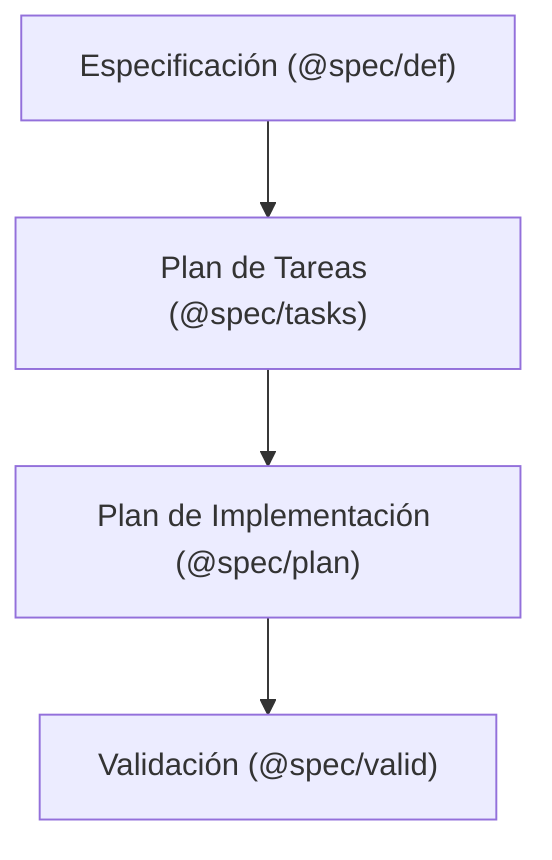

Sistema de Agentes de Ingeniería de Software - Guía Técnica Principal

# 1. Introducción y Propósito del Sistema

Este sistema constituye un ecosistema coordinado de agentes autónomos especializados (@spec/def, @spec/tasks, @spec/plan, @spec/valid), diseñado para transformar requisitos de negocio abstractos en planes de implementación técnicos rigurosamente validados. A diferencia de los flujos de desarrollo convencionales, este entorno garantiza la trazabilidad absoluta y la coherencia arquitectónica mediante un ciclo de vida cerrado y auditorías automáticas de conocimiento.

Como Ingeniero de Sistemas, debe considerar este documento como su punto de entrada mandatorio y el mapa de navegación operativo. Su propósito es proporcionar la estructura lógica, las reglas de gobernanza y las instrucciones de despliegue necesarias para operar el sistema Kilocode con éxito.

# 2. Índice de Documentación de Referencia

La siguiente tabla centraliza los artefactos críticos del sistema, el agente responsable de su integridad y el propósito técnico de cada uno.

| Documentación | Agente Responsable                 | Propósito                                                                                                                   |
| ------------- | ---------------------------------- | --------------------------------------------------------------------------------------------------------------------------- |
| spec.md       | [@spec/def](agent/spec/def.md)     | Definición funcional agnóstica a la tecnología. Identificación de Unidades Demostrables (DU) y Requisitos Funcionales (RF). |
| tasks.md      | [@spec/tasks](agent/spec/tasks.md) | Diseño de la arquitectura global, definición de Reglas Técnicas (RT) y descomposición en tareas de ingeniería.              |
| plan.md       | [@spec/plan](agent/spec/plan.md)   | Plan detallado de implementación técnica para una tarea específica, optimizado para la fase de codificación.                |
| valid.md      | [@spec/valid](agent/spec/valid.md) | Auditoría final de estados, validación de calidad y verificación de coherencia.                                             |

# 3. Flujo de Trabajo Operativo (Lifecycle)

## Ciclo de Vida de Ingeniería

El flujo de trabajo es estrictamente secuencial y acumulativo. Ningún agente debe iniciar su fase sin que el artefacto predecesor haya alcanzado el estado de "Finalizada" o "Implementada", según corresponda.



## Control del ciclo
Para interactuar con el sistema, se utilizan comandos específicos desde la terminal de Kilocode:
- Inicio: Para crear una nueva especificación desde cero, ejecuta el comando [/spec-crear](commands/spec-crear.md) desde el agente .
- Activación: Para retomar el trabajo en una funcionalidad existente, ejecuta [/spec-activar](commands/spec-activar.md)  desde cualquier agente.

> Importante: El sistema respeta el Principio de Responsabilidad Única. Un agente de tareas no puede modificar directamente una especificación; debe solicitar el cambio para que el agente especialista correspondiente lo valide y lo plasme.

## Gestión de Cambios y Retroalimentación

La integridad del sistema se protege mediante el comando obligatorio [/spec-cambiar](commands/spec-cambiar.md). Los ingenieros deben utilizar este mecanismo cuando un agente en una fase avanzada detecta inconsistencias o necesidades de refinamiento en documentos previos finalizados, garantizando la agilidad del desarrollo.

El sistema garantiza la trazabilidad registrando estos cambios en la carpeta `cambios/`, generando archivos específicos según el flujo de retroalimentación:

* plan_tasks.md: Registra cambios solicitados por [@spec/plan](agent/spec/plan.md) hacia el plan de tareas.
* tasks_spec.md: Registra cambios solicitados por [@spec/tasks](agent/spec/tasks.md) hacia la especificación funcional.

### Detección de Conflictos ([Corin](include/spec/corin.md)/[@Claron](agent/spec/claron.md))

La coherencia del sistema se apoya en el motor [Corin](include/spec/corin.md), que utiliza al sub-agente [@Claron](agent/spec/claron.md) para validar el cumplimiento de las reglas globales (histórico de decisiones tomadas en un proyecto). Para maximizar la precisión, [@Claron](agent/spec/claron.md) opera en dos modos de aislamiento estricto:

1. Modo "Negocio": Valida la coherencia de spec.md contra las Reglas de Negocio (BR) y el Diccionario de Conceptos.
2. Modo "Tecnico": Valida la coherencia de tasks.md y plan.md contra las Reglas Técnicas (RT) globales.

# 4. Infraestructura y Reutilización de Lógica

## Plataforma Kilocode

[Kilocode](https://kilo.ai/) es la infraestructura operativa sobre la que se ejecutan los agentes y comandos. Es la base que permite la orquestación de los flujos de trabajo automatizados.

## Reutilización de Lógica

La carpeta [include/](include/) es el pilar fundamental para la reutilización de lógica y estándares. Aquí se alojan las guías maestras que los agentes consultan para garantizar que el output cumpla con las expectativas de calidad del sistema, entre otras muchas cosas.

Estas dos guías son independientes de la plataforma de agentes implementada, donde el ingeniero puede plasmar, tanto su diseño estratégico, como sus estándares de codificación. Siéntase libre de adaptarlas o cambiarlas a sus necesidades. Estos dos guías son solo un ejemplo.

- [Bluesprint](include/bluesprint/bluesprint.md): Define el diseño estratégico y los patrones de arquitectura (especialmente para Rust). Implementa los principios DRY, SOLID, KISS y el POLA (Principio del Menor Asombro).
- [Coder](include/coder/coder.md): Establece la ejecución táctica, definiendo estándares de codificación, protocolos de testing (unitarios e integración), refactorización y estilos de documentación.

# 5. Instrucciones de Despliegue y Configuración

## Ubicaciones y rutas del Sistema

Para que el ecosistema funcione, los archivos de configuración deben residir en una de las siguientes ubicaciones:

- Instalación Local: En la raíz de su proyecto, bajo el directorio `.kilo/`.
- Global (Para todos tus proyectos):
  - Linux: `.config/kilo/`.
  - Windows: `%APPDATA%\kilo` (o la ruta equivalente de configuración de aplicaciones).

Tanto en la instalación local como en la global, se debe respetar estrictamente la siguiente jerarquía (copie las siguientes carpetas a la ruta de su proyecto o la ruta global de kilocode, teniendo en cuenta las ubicaciones establecidas anteriormente):

- [agent/](agent/): Definiciones de agentes (spec.md, tasks.md, plan.md, valid.md, claron.md).
- [commands/](commands/): Scripts de comandos operativos (spec-crear.md, spec-activar.md, spec-cambiar.md).
- [include/](include/): Guías maestras, checklists de calidad y lógica de validación.

## El Workspace del Proyecto: Carpeta specs/

Es fundamental distinguir entre los archivos de configuración del sistema de agentes y los artefactos de trabajo. Toda la producción de los agentes (las especificaciones y planes generados) se almacena en el directorio `specs/`. Cada funcionalidad se organiza en sub-carpetas numeradas y fechadas (timestamped) para evitar colisiones y mantener un histórico claro.

```
PROYECTO_RAIZ/
├── .kilo/ (o ~/.config/kilo/)
│   ├── agent/
│   ├── commands/
│   └── include/
├── doc/
│   ├── reglas-globales-negocio.json (BR)
│   ├── reglas-globales-tecnicas.json (RT)
│   └── conceptos.json
└── specs/
    └── 20240520-103005-mi-funcionalidad/
        ├── spec.md
        ├── tasks.md
        ├── cambios/  
        ├── calidad/
        └── tasks/
            └── t1/
                └── plan.md
                └── calidad.md
```

