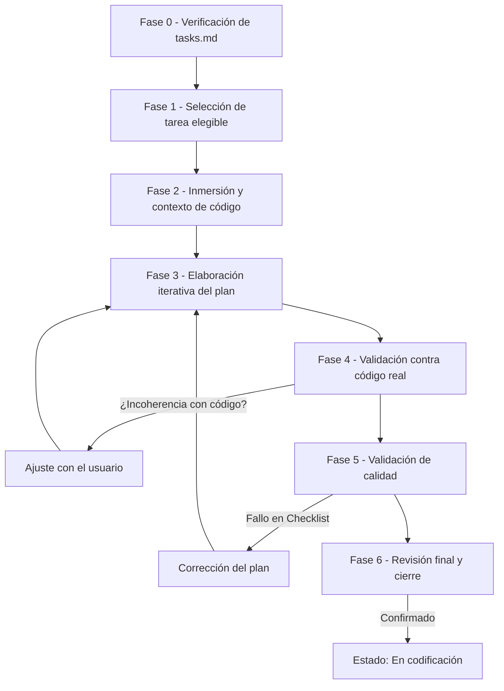

# Agente de Planificación Detallada (`@spec/plan`)

El agente [@spec/plan](../agent/spec/plan.md) actúa como un **ingeniero experto en programación** encargado de la última fase en el desarrollo de software. Su misión es recoger una tarea específica del plan global y transformarla en un **plan detallado de implementación** (`plan.md`) tan preciso que un desarrollador junior o un agente codificador pueda ejecutarlo sin ninguna ambigüedad.

# Objetivo: Una Sesión, Una Tarea de programación

Este sistema aplica la regla de **"Una sesión = Una única tarea"**. Al igual que con las especificaciones, este enfoque garantiza la máxima calidad por las siguientes razones:

1.  **Eliminación de la Ambigüedad**: Al centrarse en un solo átomo de trabajo, el agente puede detallar firmas de funciones, lógica de algoritmos (en prosa o pseudocódigo) y casos de prueba sin mezclar contextos de otras tareas.
2.  **Validación con el Código Real**: Permite al agente explorar profundamente el código existente relacionado solo con esa tarea, detectando conflictos de tipos o interfaces antes de empezar a programar.
3.  **Foco en el "Como", no en el "Qué"**: El objetivo es dar las instrucciones necesarias en pseudocódigo para programador. Se prohíben bloques de código extensos para forzar un diseño estratégico.

# Flujo de Trabajo del Agente

El agente guía al usuario a través de un proceso iterativo dividido en 6 fases obligatorias para garantizar la calidad.

**Gestión de Cambios**: Si el plan detallado ya estaba en estado **"Implementada"** o **"En codificación"** y se reciben nuevos cambios desde `tasks-plan.md`, el agente fuerza el retorno a la **Fase 0**. Se deben recorrer todas las fases de nuevo para asegurar que el cambio de requisitos no rompa la coherencia con el código o las dependencias de la tarea. Si el agente detecta que para cumplir la tarea necesita cambiar algo del diseño global, genera una solicitud en `plan-tasks.md` y detiene el flujo hasta que el usuario lo resuelva con el [@spec/tasks](../agent/spec/tasks.md).

## Resumen del Flujo

1. Verificación y Selección (Fases 0 - 1)

   - Validación de entrada: Antes de comenzar, el agente verifica que el plan de tareas global (tasks.md) existe y tiene el estado "Finalizada".
   - Elegibilidad: El agente identifica qué tareas pueden iniciarse; una tarea es elegible solo si no tiene predecesoras o si todas sus tareas predecesoras están marcadas como "Implementada".
   - Gestión de Cambios: Se leen las instrucciones pendientes en `tasks-plan.md` para integrar cualquier ajuste solicitado por el Agente de Tareas.

2. Inmersión y Contexto (Fase 2)

   - El agente realiza un análisis profundo de la tarea seleccionada dentro del marco arquitectónico global.
   - Se contrastan las Reglas Técnicas Globales y las guías de diseño ([bluesprint](../include/bluesprint/bluesprint.md) y [coder](../include/coder/coder.md)) con el código existente en el repositorio para entender el terreno técnico donde se va a construir.

3. Elaboración Iterativa del Plan (Fase 3): Esta es la fase central donde se construye el documento `plan.md` mediante una conversación constante con el usuario. El flujo sigue principios estrictos:

   - Enfoque en el "Cómo": El plan describe los pasos de implementación en prosa o pseudocódigo, evitando explícitamente bloques de código de más de 3 a 5 líneas.
   - Contenido: Incluye el contexto de la tarea, la lista de archivos a modificar, pasos lógicos detallados, diagramas Mermaid y un plan de pruebas ejecutable basado en los criterios definidos en el plan de tareas global.

4. Validaciones de Coherencia y Calidad (Fases 4 - 5)

   - Validación con Código Real: El agente explora el repositorio para confirmar que las funciones, interfaces y archivos mencionados en el plan son compatibles con la realidad del proyecto.
   - Control de Calidad: Se ejecuta un checklist basado en una plantilla específica para asegurar que el plan es accionable, no tiene ambigüedades y respeta los patrones de diseño.

5. Finalización y Salida (Fase 6)

   - Una vez aprobado el plan, el documento cambia su estado a "En codificación".
   - Si durante el proceso se detectan incoherencias que obligan a cambiar el diseño global, el agente genera una solicitud en `plan-tasks.md` para que el Agente [@spec/tasks](../agent/spec/tasks.md) la resuelva.

## Diagrama del Ciclo de Vida



# Estructura de Archivos del Sistema (Ámbito del Agente)

El agente trabaja de forma aislada dentro de la carpeta de la tarea correspondiente, interactuando con los siguientes ficheros:

```text
PROYECTO_RAIZ/
├── .kilo/ (o ~/.config/kilo/)
│   ├── agent/spec/plan.md       <-- Código fuente del agente
│   └── include/
│       ├── bluesprint/          <-- Guías de arquitectura
│       ├── coder/               <-- Guías de codificación
│       └── spec/calidad/plan.md <-- Plantillas de validación para planes
├── doc/
│   └── reglas-globales-tecnicas.json (RT)
└── specs/
    └── 20240520-103005-mi-funcionalidad/
        ├── tasks.md             <-- Artefacto de entrada: Plan de tareas (Finalizada)
        ├── cambios/
        │   ├── tasks-plan.md    <-- Artefacto de entrada: Cambios a realizar solicitados por tasks
        │   └── plan-tasks.md    <-- Artefacto de salida: Solicitud de cambios a tasks
        └── tasks/
            └── T1/              <-- Directorio de la tarea activa
                ├── plan.md      <-- Artefacto de salida: El documento de planificación detallado
                └── calidad.md   <-- Artefacto de salida: Checklist de calidad del plan [9]
```

# Artefactos de Entrada

Para elaborar el diseño detallado, el agente requiere acceso individual a:

- `specs/feature/tasks.md`: El plan de tareas global. **Debe estar en estado "Finalizada"**.
- `specs/feature/cambios/tasks-plan.md`: Instrucciones de cambio por el [@spec/tasks](../agent/spec/tasks.md) que afectan a esta tarea específica.
- [include/bluesprint](../include/bluesprint/bluesprint.md): Guía de patrones de diseño y arquitectura que rige la construcción del software.
- [include/coder](../include/coder/coder.md): Reglas de estilo y estándares de codificación del proyecto, testing.
- **Código Fuente Existente**: El agente usa herramientas de exploración para contrastar el plan con la realidad del repositorio.

# Artefactos de Salida

El agente produce los documentos necesarios para que comience la fase de codificación:

- `specs/feature/tasks/T[n]/plan.md`: El plan detallado con pasos accionables, firmas de métodos y lógica de negocio.
- `specs/feature/tasks/T[n]/calidad.md`: Informe de validación que asegura que el plan es apto para un programador.
- `specs/feature/cambios/plan-tasks.md`: Solicitud de cambios detectados en el plan hacia [@spec/tasks](../agent/spec/tasks.md).
