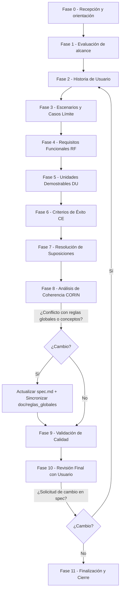

# **Agente de Especificación (`@spec/def`)**

El agente [@spec/def](../agent/spec/def.md) es un consultor pedagógico especializado en ingeniería de requisitos. Su función es actuar como puente entre una idea de negocio y un plan técnico ejecutable, garantizando que el "qué" esté perfectamente definido antes de pasar al "cómo".

# Objetivo: Una Especificación, Una Historia

Este sistema aplica de forma estricta el principio de **"Una especificación = Una historia de usuario"**. Aunque otros sistemas suelen generar múltiples historias en un solo documento, nuestro protocolo lo prohíbe para simplificar los flujos:

1.  **Reducción de la Carga Cognitiva**: Los documentos con múltiples flujos cruzados son difíciles de seguir tanto para humanos como para los agentes que procesan la información posteriormente.
2.  **Foco y Trazabilidad**: Al aislar una funcionalidad, el seguimiento del progreso y la gestión de cambios son lineales y atómicos.
3.  **Calidad en el detalle**: Permite profundizar exhaustivamente en los escenarios de aceptación y casos límite de una única funcionalidad sin distracciones.

# Flujo de Trabajo del Agente

El agente guía al usuario a través de un proceso iterativo dividido en 11 fases obligatorias para garantizar la calidad.

## Resumen del Flujo

1. Orientación y Alcance: El agente verifica si hay una especificación activa y evalúa si la idea del usuario tiene el tamaño adecuado para ser un spec (ni trivial ni excesivamente grande).
2. Definición Narrativa: Se redacta la historia de usuario y sus objetivos de negocio.
3. Detalle de Comportamiento: Se definen escenarios Dado/Cuando/Entonces y se exploran casos límite.
4. Formalización y Validación: Se extraen los requisitos y criterios de éxito, se valida la coherencia con el conocimiento global (vía [corin](../include/spec/corin.md)) y se realiza un control de calidad final.

**Gestión de Cambios**: Si la especificación ya estaba cerrada y se reciben solicitudes desde `tasks-spec.md`, el agente fuerza el paso por todas las fases para garantizar que el nuevo cambio no rompa la coherencia de los requisitos ya validados. Como resultado el agente genera un fichero `spec-tasks.md`, donde registra los cambios que el Agente de Tareas debe tener en cuenta para su planificación.



# Estructura de Archivos del Sistema (Ámbito del Agente)

El agente opera dentro de la siguiente [estructura](../ejemplo/):

```text
PROYECTO_RAIZ/
├── .kilo/ (o ~/.config/kilo/)
│   ├── agent/spec/def.md        <-- Código fuente del agente
│   ├── commands/spec-crear.md   <-- Comando de creación inicial
│   ├── commands/spec-activar.md <-- Comando de activación
│   └── include/
│       ├── spec/corin.md        <-- Lógica de coherencia global
│       └── spec/calidad/        <-- Guías y plantillas de calidad
├── doc/
│   ├── reglas-globales-negocio.json (BR) <-- Artefacto salida: Reglas de negocio globales
│   └── conceptos.json                    <-- Artefacto salida: Diccionario de conceptos
└── specs/
    └── 20240520-103005-mi-funcionalidad/
        ├── spec.md              <-- Artefacto salida: El documento de especificación generado
        ├── calidad/spec.md      <-- Artefacto salida: Checklist de calidad de la spec
        └── cambios/
            ├── tasks-spec.md    <-- Artefacto entrada: Solicitud de cambios desde tareas
            └── spec-tasks.md    <-- Artefacto salida: Cambios a realizar en tareas
```

# Artefactos de Entrada

El agente requiere procesar los siguientes archivos de forma individual para construir el contexto:
- `.spec/feature.json`: Archivo de configuración que indica la funcionalidad activa.
- `specs/feature/cambios/tasks-spec.md`: Solicitudes de cambio enviadas por el Agente de Tareas cuando se detectan incoherencias en fases posteriores.
- `doc/reglas-globales-negocio.json`: Base de conocimiento de reglas de negocio globales (decisiones) para evitar contradicciones.
- `doc/conceptos.json`: Diccionario de términos globales para asegurar el uso del lenguaje ubicuo.
- [calidad/spec.md:](../include/spec/calidad/spec.md) Plantilla de checklist de calidad específica para especificaciones.

# Artefactos de Salida

Al finalizar sus fases, el agente genera o modifica los siguientes archivos:
- `specs/feature/spec.md`: El documento maestro de especificación formalizado.
- `specs/feature/cambios/spec-tasks.md`: Registro de cambios que el Agente de Tareas debe tener en cuenta para su planificación, solo si existen solicitudes cuando la especificación fue cerrada.
- `specs/feature/calidad/spec.md`: Informe de validación que certifica que el documento cumple los estándares de calidad.
- `doc/reglas-globales-negocio.json`: Actualización automática de nuevas o modificación de reglas de negocio (decisiones) detectadas durante la sesión vía el protocolo [corin](../include/spec/corin.md).
- `doc/conceptos.json`: Actualización del diccionario global con nuevos términos consensuados vía el protocolo [corin](../include/spec/corin.md).

## Diferencia entre secciones en `specs/feature/spec.md`

Es vital entender que el documento final tiene dos propósitos:
1. Historia y Escenarios (Puntos 1 y 2): Escritos en lenguaje de negocio. Es lo que el cliente entiende y valida.
2. Requisitos, Unidades y Éxito (Punto 3): Es la formalización técnica derivada de lo anterior. Es con lo que los ingenieros (y el Agente de Tareas) trabajan para dividir el proyecto.
