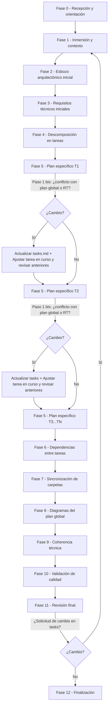

# **Agente de Planificación de Tareas** (`@spec/tasks`)

El agente [@spec/tasks](../agent/spec/tasks.md) actúa como un líder técnico e ingeniero arquitecto. Su misión es recoger una especificación de negocio finalizada y transformarla en un **plan arquitectónico global**, garantizando que la arquitectura sea sólida, coherente con el código existente y **divisible en tareas independientes**.

# Objetivo: Arquitectura y Descomposición Estratégica

A diferencia del agente de especificación (que define el "qué"), el Agente de Tareas se centra en el **"cómo" a nivel estructural**. Sus objetivos principales son:

1. **Liderazgo Técnico sin Implementación**: El agente diseña globalmente la solución y organiza el trabajo, pero **nunca escribe código**. Esto asegura que el diseño sea estratégico.
2. **Arquitectura Global**: Define cómo interactúan los componentes, qué patrones de diseño (vía [bluesprint](../include/bluesprint/bluesprint.md)) se deben aplicar y qué requisitos técnicos (RT) rigen la solución.
3. **Maximización del Paralelismo**: Su meta es descomponer la funcionalidad en tareas que puedan ser abordadas, en la medida de lo posible, de forma simultánea, eliminando bloqueos innecesarios entre desarrolladores.
 
# Flujo de Trabajo del Agente

El agente guía al usuario a través de un proceso iterativo dividido en 12 fases obligatorias para garantizar la calidad.

## Resumen del Flujo

1. Preparación e Inmersión (Fases 0 - 1)

   - Verificación: El agente se asegura de que la especificación ( `spec.md`) esté en estado "Finalizada" antes de empezar.
   - Contexto: Analiza el código existente, las reglas técnicas globales y la guía [bluesprint](../include/bluesprint/bluesprint.md) para entender las restricciones y patrones que debe respetar la nueva funcionalidad.

2. Diseño Global y Requisitos (Fases 2 - 3)

   - Esbozo Arquitectónico: Define los componentes, módulos y flujos principales de forma textual, evitando aún los detalles de implementación.
   - Requisitos Técnicos (RT): Establece las restricciones de rendimiento, seguridad, entorno y decisiones tecnológicas (como qué bases de datos o librerías usar).

3. Descomposición y Detalle (Fases 4 - 5)

   - División de Tareas: Descompone la funcionalidad en tareas padre, buscando maximizar el trabajo en paralelo.
   - Plan Específico por tarea: Para cada tarea, detalla los pasos de implementación y define los casos de prueba automatizados que validarán el éxito de esa unidad de trabajo.

4. Organización y Visualización (Fases 6 - 8)

   - Dependencias: Crea un diagrama de dependencias estricto para asegurar que el orden de ejecución es lógico y sin ciclos.
   - Sincronización: Organiza físicamente el proyecto creando las carpetas correspondientes para cada tarea (ej: tasks/T1/).
   - Diagramas Formales: Genera los diagramas definitivos (componentes, secuencia, estados) una vez que el diseño de todas las tareas es firme.

5. Calidad y Cierre (Fases 9 - 12)

   - Auditoría de Coherencia: Ejecuta el protocolo [corin](../include/spec/corin.md) para verificar que ninguna decisión técnica contradice las reglas globales del proyecto.
   - Validación de Calidad: Evalúa el documento final contra un checklist de calidad para asegurar que no hay ambigüedades.
   - Finalización: Cambia el estado del documento a "Finalizada" y, si es necesario, propaga cambios a los niveles inferiores (agentes de implementación).

**Gestión de Cambios**: Si el plan de tareas ya estaba cerrado (estado Finalizada) y se reciben solicitudes desde el fichero `cambios/plan-tasks.md` (a través del agente [@spec/plan](../agent/spec/plan.md)), el agente fuerza el paso por todas las fases del ciclo de vida para garantizar que el nuevo cambio no rompa la coherencia de la arquitectura global, los requisitos técnicos o la división de tareas ya validadas. Como resultado de este proceso, el agente genera o actualiza el fichero `cambios/tasks-plan.md`, donde registra formalmente los cambios e instrucciones que el Agente de Planificación debe tener en cuenta para ajustar sus planes detallados de implementación.

Desde el agente [@spec/tasks](../agent/spec/tasks.md) se pueden solicitar cambios a el agente [@spec/def](../agent/spec/def.md), generando un registro en `cambios/tasks-spec.md`.



# Estructura de Archivos del Sistema (Ámbito del Agente)

El agente opera dentro de la siguiente estructura, gestionando la transición entre los requisitos y la planificación de tareas:

```text
PROYECTO_RAIZ/
├── .kilo/ (o ~/.config/kilo/)
│   ├── agent/spec/tasks.md      <-- Código fuente del agente
│   └── include/
│       ├── bluesprint/          <-- Guías de arquitectura y diseño
│       └── spec/calidad/        <-- Plantillas de validación para tareas
├── doc/
│   └── reglas-globales-tecnicas.json (RT) <-- Reglas técnicas globales
└── specs/
    └── 20240520-103005-mi-funcionalidad/
        ├── spec.md              <-- Artefacto entrada: Especificación finalizada
        ├── tasks.md             <-- Artefacto salida: El documento de plan de tareas
        ├── calidad/tasks.md     <-- Artefacto salida: Checklist de calidad de tareas
        ├── tasks/               <-- Artefacto salida:: Directorios de tareas (T1, T2...)
        └── cambios/
            ├── spec-tasks.md    <-- Artefacto entrada: Cambios a realizar solicitados por spec
            ├── plan-tasks.md    <-- Artefacto entrada: Solicitud de cambios desde el plan
            ├── tasks-spec.md    <-- Artefacto salida: Solicitud de cambios a spec
            └── tasks-plan.md    <-- Artefacto salida: Cambios a realizar hacia el plan
```

# Artefactos de Entrada

Para realizar su labor de ingeniería, el agente procesa individualmente:

- `specs/feature/spec.md`: Documento maestro de especificación. **Debe estar en estado "Finalizada"**.
- `specs/feature/cambios/spec-tasks.md`: Cambios realizados en la especificación que el agente debe reflejar en el plan de tareas.
- `specs/feature/cambios/plan-tasks.md`: Solicitudes de ajuste enviadas por el agente [@spec/plan](../agent/spec/plan.md) tras detectar problemas en el nivel de implementación.
- `doc/reglas-globales-tecnicas.json`: Restricciones técnicas globales del proyecto que deben cumplirse.
- [include/bluesprint](../include/bluesprint/bluesprint.md): Guía de patrones de diseño y arquitectura que rige la construcción del software.
- [calidad/tasks.md:](../include/spec/calidad/tasks.md) Plantilla de checklist de calidad específica para tasks. 

# Artefactos de Salida

El agente genera y mantiene el ecosistema técnico de la funcionalidad:

*   `specs/feature/tasks.md`: El documento maestro que contiene el plan arquitectónico global y la lista de tareas detalladas.
*   `specs/feature/calidad/tasks.md`: Informe que certifica que el plan técnico cumple con los estándares de arquitectura y consistencia.
*   `specs/feature/cambios/tasks-spec.md`: Solicitudes formales de cambio hacia el [@spec/spec](../agent/spec/def.md) si se detecta que el diseño técnico requiere modificar el negocio.
*   `specs/feature/cambios/tasks-plan.md`: Instrucciones y correcciones que el agente [@spec/plan](../agent/spec/plan.md) debe considerar para cada tarea.
*   `specs/feature/tasks/T[n]/`: Creación y sincronización de la estructura de carpetas física para cada tarea detectada.
*   `doc/reglas-globales-tecnicas.json`: Actualizaciones de la base de conocimiento técnica global mediante el protocolo [@corin](../include/spec/corin.md).
