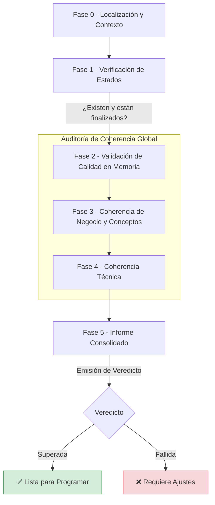

# Agente Validador Final (`@spec/valid`)

El agente [@spec/valid](../agent/spec/valid.md) actúa como un **auditor estricto**. Su misión es realizar la inspección técnica final de todo el ecosistema de documentos (especificación, tareas y planes detallados) para certificar que el flujo se ha completado con éxito, que se respetan los estándares de calidad y que existe una coherencia total con el conocimiento global del proyecto.

# Objetivo: Garantía de Calidad y Veredicto Final

A diferencia de los agentes de definición y planificación, el Validador no crea contenido nuevo ni toma decisiones de diseño. Sus objetivos fundamentales son:

1. **Auditoría de Estados**: Verificar que cada documento en la cadena (`spec.md`, `tasks.md` y todos los `plan.md`) ha alcanzado su estado de finalización requerido.
2. **Validación Cruzada de Calidad**: Re-evaluar de forma independiente cada checklist de calidad para asegurar que no se han pasado por alto errores o ambigüedades.
3. **Certificación de Coherencia**: Comprobar, mediante el protocolo [corin](../include/spec/corin.md), que ninguna decisión tomada en la funcionalidad actual entra en conflicto con las reglas de negocio o técnicas globales del repositorio.
4. **Emisión de Veredicto**: Proporcionar un informe consolidado.

# Flujo de Trabajo del Agente

El agente guía al usuario a través de un proceso iterativo dividido en 5 fases obligatorias para garantizar la calidad.

## Resumen del Flujo

1. Localización y Verificación de Estados (Fases 0 - 1)

   - Identificación: El agente localiza el directorio de la funcionalidad activa mediante el fichero `.spec/feature.json`.
   - Control de Estados: Verifica que los documentos maestros tengan el estado requerido para proceder:
     - `spec.md`: Debe estar en estado "Finalizada".
     - `tasks.md`: Debe estar en estado "Finalizada".
     - `plan.md`: Se comprueba que cada tarea definida en el plan global tenga su correspondiente documento de planificación detallada en estado "Implementada".

2. Auditoría de Calidad en Memoria (Fase 2)

     - Validación sin escritura: A diferencia de otros agentes, [@spec/valid](../agent/spec/valid.md) no genera ficheros de calidad físicos, sino que carga las plantillas de checklist (spec, tasks y plan) y evalúa cada documento en memoria.
     - Rigurosidad: Revisa que se cumplan todos los puntos, desde la ausencia de detalles técnicos en la especificación hasta la existencia de pasos accionables en los planes de implementación.

3. Validación de Coherencia Global (Fases 3 - 4)
  El agente utiliza al sub-agente [@spec/claron](../agent/spec/claron.md) para contrastar la funcionalidad con el conocimiento global del proyecto:
     - Coherencia de Negocio: Verifica que las reglas de negocio y conceptos de la especificación no contradigan los ficheros `reglas-globales-negocio.json` y `conceptos.json`.
     - Coherencia Técnica: Asegura que las decisiones tomadas en el plan de tareas respeten las `reglas-globales-tecnicas.json`.
     - Detección de Inconsistencias: Cualquier conflicto de tipo "vs" (regla contra regla) se considera un fallo automático que debe ser resuelto por el agente responsable.

1. Informe Consolidado y Veredicto (Fase 5): El agente finaliza su ejecución emitiendo un veredicto profesional basado en los hallazgos previos:
     - ✅ VALIDACIÓN SUPERADA: Todos los documentos existen, tienen el estado correcto y cumplen el 100% de los criterios de calidad.
     - ⚠️ VALIDACIÓN PARCIAL: Los documentos existentes pasan los controles de calidad, pero el flujo está incompleto (faltan estados o archivos).
     - ❌ VALIDACIÓN FALLIDA: Se han detectado errores de calidad o inconsistencias técnicas/de negocio que requieren corrección inmediata.



# Estructura de Archivos del Sistema (Ámbito del Agente)

El agente opera dentro de la siguiente [estructura](../ejemplo/):

```text
PROYECTO_RAIZ/
├── .kilo/ (o ~/.config/kilo/)
│   ├── agent/spec/valid.md      <-- Código fuente del agente
│   └── include/
│       ├── bluesprint/          <-- Reglas de arquitectura de referencia
│       ├── coder/               <-- Reglas de codificación de referencia
│       └── spec/calidad/        <-- Plantillas de checklists de calidad
├── doc/
│   ├── reglas-globales-negocio.json (BR)
│   ├── reglas-globales-tecnicas.json (RT)
│   └── conceptos.json
└── specs/
    └── 20240520-103005-mi-funcionalidad/
        ├── spec.md              <-- Artefacto de entrada: Fichero de especificaciones
        ├── tasks.md             <-- Artefacto de entrada: Fichero de arquitectura global y división de tareas
        └── tasks/
            └── T[n]/
                └── plan.md      <-- Artefacto de entrada: Fichero del plan de implementación detallado
```

# Artefactos de Entrada

Al ser un auditor integral, el agente procesa todos los documentos generados en el ciclo de vida:

*   `specs/feature/spec.md`: Documento maestro de requisitos.
*   `specs/feature/tasks.md`: Plan técnico y arquitectónico.
*   `specs/feature/tasks/T[n]/plan.md`: Todos los planes detallados de las tareas definidas.
*   `doc/reglas-globales-*`: Ficheros de reglas globales (negocio y técnicas) y diccionario de conceptos.
*   `include/spec/calidad/*.md`: Instrucciones y plantillas para validar la calidad de cada tipo de archivo.

# Artefactos de Salida: El Informe de Validación

El agente no modifica los archivos de la funcionalidad (es de solo lectura). Su salida es un **Informe Consolidado** que presenta:

1.  **Tabla de Estados**: Un resumen de qué documentos existen y si tienen el estado correcto.
2.  **Checklist Detallada**: Los resultados de pasar las plantillas de calidad a cada documento en memoria.
3.  **Veredicto Final**:
    - ✅ **VALIDACIÓN SUPERADA**: Todo está en orden y listo para la fase de desarrollo.
    - ⚠️ **VALIDACIÓN PARCIAL**: Faltan estados o documentos, pero lo existente es de calidad.
    - ❌ **VALIDACIÓN FALLIDA**: Se han detectado errores de calidad o incoherencias que deben ser resueltos por los agentes responsables.
