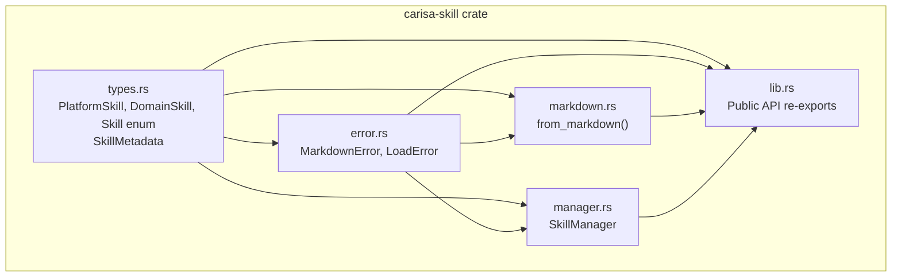
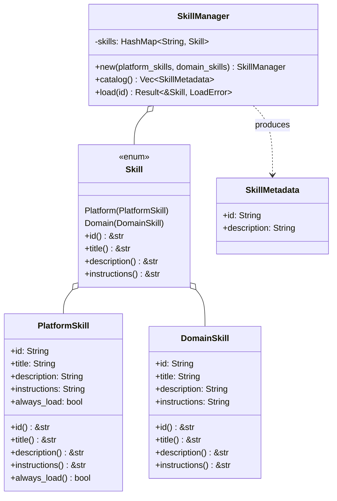
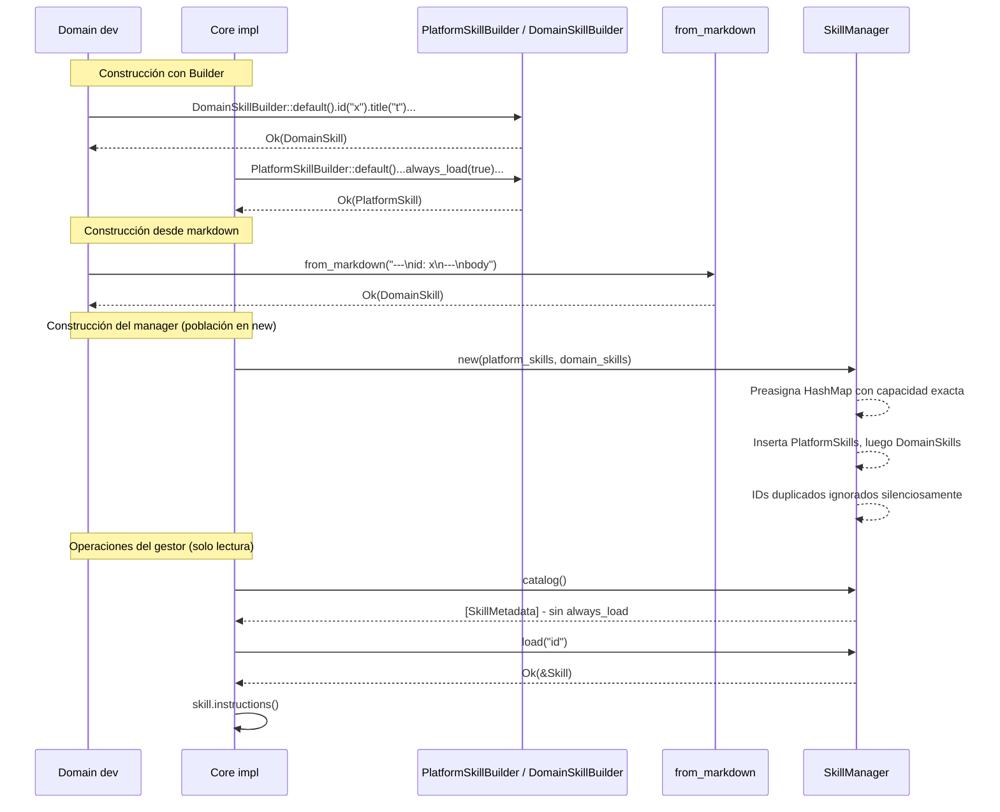
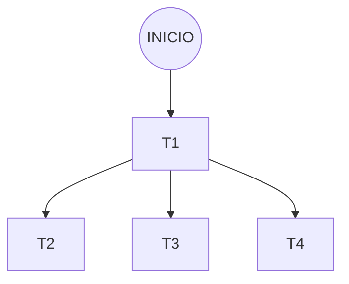

# Plan de Tareas: Definición, Carga y Registro de Skills

**Creada**: 2026-06-16
**Estado**: Finalizada

---

## Plan arquitectónico global

### Componentes y responsabilidades

**Módulo `types.rs`** — Definiciones de datos y contrato público:
- `PlatformSkill`: struct con campos `id`, `title`, `description`, `instructions`, `always_load`. Deriva `Builder` (`derive_builder` con `pattern = "owned"`). Solo el core puede instanciarlo.
- `DomainSkill`: struct con campos `id`, `title`, `description`, `instructions`. Deriva `Builder` (`derive_builder` con `pattern = "owned"`). Lo usa el desarrollador de dominio.
- `enum Skill { Platform(PlatformSkill), Domain(DomainSkill) }`: tipo algebraico para almacenamiento homogéneo en el manager. Evita `dyn Trait` y heap allocation extra.
- `SkillMetadata`: struct ligero con `id` + `description`. Es lo que devuelve el catálogo del manager.
- Métodos inherentes en `PlatformSkill` (bloque `impl` separado del Builder): `pub fn id(&self) -> &str`, `pub fn title(&self) -> &str`, `pub fn description(&self) -> &str`, `pub fn instructions(&self) -> &str`, `pub(crate) fn always_load(&self) -> bool`.
- Métodos inherentes en `DomainSkill` (bloque `impl` separado): `pub fn id(&self) -> &str`, `pub fn title(&self) -> &str`, `pub fn description(&self) -> &str`, `pub fn instructions(&self) -> &str`.
- `enum Skill`: implementa `pub fn id(&self) -> &str`, `pub fn title(&self) -> &str`, `pub fn description(&self) -> &str`, `pub fn instructions(&self) -> &str` vía `match` sobre sus variantes. Cero coste, sin dynamic dispatch.

**Módulo `error.rs`** — Tipos de error con `thiserror`:
- `MarkdownError`: errores del constructor desde markdown (YAML inválido, propiedades ausentes, cuerpo vacío, delimitadores incorrectos). Incluye el `id` del skill como contexto cuando está disponible.
- `LoadError`: error cuando se solicita un `id` que no existe en el manager.

**Módulo `markdown.rs`** — Constructor alternativo desde fichero markdown:
- `from_markdown(content: &str) -> Result<DomainSkill, MarkdownError>`: parsea el frontmatter YAML delimitado por `---` para extraer `id`, `title`, `description`, y toma el resto del cuerpo como `instructions`. Construye `DomainSkill` directamente (sin depender del Builder, para permitir paralelismo con T2).

**Módulo `manager.rs`** — Gestor de skills:
- `SkillManager`: mantiene los skills en un `HashMap<String, Skill>`. La población ocurre exclusivamente en construcción. Expone:
  - `new(platform_skills: Vec<PlatformSkill>, domain_skills: Vec<DomainSkill>) -> Self` — constructor único. Preasigna capacidad exacta en el `HashMap` (`platform_skills.len() + domain_skills.len()`). Itera primero `platform_skills` insertando vía `entry().or_insert()`, luego `domain_skills` con la misma lógica (los `id` duplicados se ignoran silenciosamente según RF-010). Tras la construcción, el manager es inmutable.
  - `catalog(&self) -> Vec<SkillMetadata>` — devuelve `id` + `description` de todos los skills, excluyendo los `always_load: true`. Si no hay skills, devuelve lista vacía.
  - `load(&self, id: &str) -> Result<&Skill, LoadError>` — devuelve una referencia al skill identificado por `id`. El consumidor obtiene las instrucciones vía `load("x")?.instructions()` sin clon. Cero coste.
- Todos los métodos toman `&self`. El manager es `Send + Sync + 'static` y se comparte vía `Arc` para ser usable desde contextos tokio. El mecanismo de sincronización interna es detalle de implementación (RT-006).

### Relaciones entre componentes

- `types.rs` es el núcleo de datos, usado por todos los demás módulos.
- `error.rs` es usado por `markdown.rs` y `manager.rs`.
- `markdown.rs` produce `DomainSkill` accediendo directamente a sus campos (`pub(crate)`).
- `manager.rs` almacena `enum Skill` y expone las operaciones del gestor (`new`, `catalog`, `load`).
- `lib.rs` re-exporta la API pública: `Skill`, `SkillMetadata`, `DomainSkill`, `DomainSkillBuilder`, `from_markdown`, `SkillManager`, `LoadError`, `MarkdownError`. `SkillMeta` se elimina del re-export. Los builders de `PlatformSkill` son `pub(crate)`.

### Decisiones arquitectónicas clave

1. **Dos structs separados con `#[derive(Builder)]`**: `PlatformSkill` y `DomainSkill` son tipos distintos con builders generados automáticamente por `derive_builder`. BR-008 y CL-01 quedan garantizados estructuralmente por el compilador.
2. **`enum Skill` para almacenamiento**: evita `dyn Trait`, una sola asignación por skill, sin _dynamic dispatch_.
3. **Métodos inherentes como API pública**: cada struct (`PlatformSkill`, `DomainSkill`) y el `enum Skill` exponen métodos inherentes (`id()`, `title()`, `description()`, `instructions()`) en lugar de un trait. Esto elimina la indirección de trait, simplifica los consumidores (sin necesidad de importar `SkillMeta`), y mantiene despacho estático a costo cero. El `enum Skill` delega en sus variantes vía `match`.
4. **Manager con `HashMap<String, Skill>` poblado en construcción**: toda la población ocurre en `new()`, que recibe ambos vectores, preasigna capacidad exacta y resuelve duplicados silenciosamente (RF-010). Tras construir, el manager es inmutable. Operaciones en memoria, sin dependencias externas (Temporal, Qdrant, BD, red). `Arc` permite compartir entre tareas tokio.
5. **`from_markdown` construye `DomainSkill` directamente (sin Builder)**: maximiza el paralelismo entre las tareas de Builder y markdown.
6. **Errores con `thiserror`**: `MarkdownError` incluye el `id` del skill como contexto. `LoadError` para búsquedas fallidas.

<!-- Historial de cambios en esta sección (opcional):
  - 2026-06-29: Cambio aceptado por el usuario — SkillManager ahora recibe los skills en el constructor `new()` en lugar de métodos `register_*` separados. Preasigna capacidad exacta en el HashMap.
-->

### Diagramas

#### Diagrama de componentes

Muestra los cinco módulos del crate y sus dependencias. `types.rs` es el núcleo usado por todos. `error.rs` es usado por `markdown.rs` y `manager.rs`. `lib.rs` re-exporta la API pública.

#### Diagrama de tipos

Define las entidades clave: `PlatformSkill` y `DomainSkill` son tipos estructuralmente distintos, cada uno con sus propios métodos inherentes (`id()`, `title()`, `description()`, `instructions()`). `Skill` es el enum para almacenamiento homogéneo que también expone esos métodos vía `match`. `SkillMetadata` es la vista ligera para el catálogo. `SkillManager` orquesta registro, catálogo y carga.

#### Diagrama de secuencia — flujos principales

Recorre los cuatro flujos principales: construcción con Builder, construcción desde markdown, construcción del manager con todos los skills, y operaciones de consulta (catálogo y carga).

---

## Requisitos técnicos

- **RT-001**: Usar `derive_builder` para implementar cualquier patrón Builder en el proyecto.
- **RT-002**: `from_markdown` parsea frontmatter YAML delimitado por `---` (vía `serde-saphyr`, última versión disponible) y cuerpo como texto plano sin subdivisiones.
- **RT-003**: Todos los errores de cada módulo deben definirse con `thiserror`.
- **RT-004**: Las APIs públicas del crate no deben depender de ningún runtime async concreto ni de tipos de framework.
- **RT-005**: El módulo compila y ejecuta todos sus tests sin dependencia de Temporal, Qdrant, red ni base de datos.
- **RT-006**: `SkillManager` debe ser `Send + Sync + 'static` y estar diseñado para compartirse vía `Arc` desde contextos asíncronos (tokio). Sus métodos son síncronos. El mecanismo de sincronización interna es detalle de implementación.
- **RT-007**: Usar `serde` para toda serialización en el proyecto.

<!-- Historial de cambios en esta sección (opcional): -->

---

## Tareas

### T1: Tipos de datos y errores

Definición de los structs `PlatformSkill` y `DomainSkill` con `#[derive(Builder)]`, el `enum Skill` para almacenamiento homogéneo, `SkillMetadata` para el catálogo, los métodos inherentes de acceso como API pública, y los tipos de error `MarkdownError` y `LoadError` con `thiserror`.

#### Plan específico de la tarea

##### 1. Añadir dependencias al `Cargo.toml`

Añadir al `Cargo.toml` de `carisa/skill`:
- `derive_builder` — genera automáticamente los builders con `#[builder(pattern = "owned")]`
- `thiserror` — derive macro para errores
- `serde-saphyr` — parseo YAML (se usará en T3, pero la dependencia se declara ya para tener el `Cargo.toml` completo desde T1)
- `serde` — ya existe en el `Cargo.toml` actual

##### 2. Crear `types.rs`

- **`PlatformSkill`**: struct con campos `id: String`, `title: String`, `description: String`, `instructions: String`, `always_load: bool`. Deriva `Builder` (con `#[builder(pattern = "owned")]`), `Debug`, `Clone`, `Serialize`, `Deserialize`.
- **`DomainSkill`**: struct con campos `id: String`, `title: String`, `description: String`, `instructions: String`. Mismas derivas. Sin campo `always_load`.
- **`enum Skill`**: variantes `Platform(PlatformSkill)` y `Domain(DomainSkill)`. Deriva `Debug`, `Clone`.
- **`SkillMetadata`**: struct con `id: String` y `description: String`. Deriva `Debug`, `Clone`, `Serialize`.
- **`PlatformSkill`**: bloque `impl` separado del Builder con métodos inherentes públicos `id(&self) -> &str`, `title(&self) -> &str`, `description(&self) -> &str`, `instructions(&self) -> &str`, y `pub(crate) fn always_load(&self) -> bool`.
- **`DomainSkill`**: bloque `impl` separado con métodos inherentes públicos `id(&self) -> &str`, `title(&self) -> &str`, `description(&self) -> &str`, `instructions(&self) -> &str`.
- **`enum Skill`**: bloque `impl` con `pub fn id(&self) -> &str`, `pub fn title(&self) -> &str`, `pub fn description(&self) -> &str`, `pub fn instructions(&self) -> &str` — cada método hace `match` sobre las variantes y delega en el método inherente correspondiente. Cero coste, sin dynamic dispatch.

##### 3. Crear `error.rs`

- **`MarkdownError`**: enum con variantes `YamlParse`, `MissingField`, `EmptyBody`, `InvalidDelimiters`. Cada variante incluye `id: Option<String>` y `title: Option<String>` como contexto, más los campos específicos del error (`msg` con el mensaje de error YAML, `field` para campo ausente). Deriva `Error` con `thiserror`.
- **`LoadError`**: enum con variante `NotFound { id: String }`. Deriva `Error` con `thiserror`.

##### 4. Actualizar `lib.rs`

- Declarar módulos: `pub mod types;`, `pub mod error;`
- Re-exportar API pública: `DomainSkill`, `DomainSkillBuilder` (generado por `derive_builder`), `SkillMetadata`, `Skill`, `MarkdownError`, `LoadError`
- `SkillMeta` NO se re-exporta (se elimina del crate)
- `PlatformSkill` y `PlatformSkillBuilder` se declaran `pub(crate)` — solo accesibles desde el core
- Eliminar la función `add` y el módulo `tests` dummy existentes

##### 5. Tests unitarios

Tests en `types.rs`:
- Los métodos inherentes `id()`, `title()`, `description()`, `instructions()` de `PlatformSkill` devuelven los valores asignados
- Los métodos inherentes `id()`, `title()`, `description()`, `instructions()` de `DomainSkill` devuelven los valores asignados
- `DomainSkill` no tiene campo `always_load` (verificación en compilación)
- `SkillMetadata` se construye y sus campos son accesibles
- `enum Skill` acepta ambas variantes

Tests en `error.rs`:
- `MarkdownError::YamlParse` con `id: Some("x")` — el mensaje `Display` incluye `"x"`
- `MarkdownError::MissingField` con `id: None` — el mensaje `Display` es legible sin `id`
- `LoadError::NotFound { id: "x" }` — el mensaje `Display` incluye `"x"`

#### Casos de prueba

- **T1-CP1**: Los métodos inherentes `id()`, `title()`, `description()`, `instructions()` de `PlatformSkill` devuelven los valores asignados (DU-001)
- **T1-CP2**: Los métodos inherentes `id()`, `title()`, `description()`, `instructions()` de `DomainSkill` devuelven los valores asignados (DU-001)
- **T1-CP3**: `DomainSkill` no tiene campo `always_load` — no compila si se intenta acceder (CL-01, BR-008)
- **T1-CP4**: `SkillMetadata { id, description }` se construye y sus campos son accesibles (RF-006)
- **T1-CP5**: `enum Skill::Platform(skill)` y `Skill::Domain(skill)` compilan y son tipos distintos (RF-001, RF-002)
- **T1-CP6**: `MarkdownError::YamlParse` con `id: Some("x")` muestra el `id` en `Display` (RF-005, CE-003)
- **T1-CP7**: `MarkdownError::MissingField` con `id: None` muestra mensaje legible sin `id` (RF-005)
- **T1-CP8**: `LoadError::NotFound { id: "x" }` muestra `"x"` en `Display` (RF-007)

### T2: Construcción de skills con Builder

Tests que verifican que los builders generados por `derive_builder` construyen skills correctamente, que `build()` falla si faltan campos obligatorios, y que `DomainSkill` no tiene acceso a `always_load`.

#### Plan específico de la tarea

##### 1. Tests de construcción exitosa con Builder

- Construir un `PlatformSkill` con todos los campos (`id`, `title`, `description`, `instructions`, `always_load`) mediante el builder generado y verificar que `build()` devuelve `Ok(skill)` con los valores correctos.
- Construir un `DomainSkill` con todos los campos (`id`, `title`, `description`, `instructions`) mediante el builder generado y verificar que `build()` devuelve `Ok(skill)` con los valores correctos.

##### 2. Tests de campos obligatorios (CL-04)

- Intentar construir un `DomainSkill` omitiendo cada campo obligatorio (`id`, `title`, `description`, `instructions`) y verificar que `build()` devuelve `Err(...)` con un mensaje que identifica el campo ausente.
- Intentar construir un `PlatformSkill` omitiendo cada campo obligatorio (incluido `always_load`) y verificar que `build()` devuelve `Err(...)`.

##### 3. Test de aislamiento estructural (BR-008, CL-01)

- Verificar que `DomainSkillBuilder` no expone un método `.always_load(...)`. Esto se demuestra con un test de compilación: código que intente llamar `.always_load(true)` sobre `DomainSkillBuilder::default()` no debe compilar.

##### 4. Test de CE-001

- Demostrar que se puede definir y construir un `DomainSkill` completo en menos de 10 líneas de código Rust efectivo usando el Builder.

#### Casos de prueba

- **T2-CP1**: `PlatformSkillBuilder` con todos los campos produce `Ok(skill)` con valores correctos (DU-001, RF-001)
- **T2-CP2**: `DomainSkillBuilder` con todos los campos produce `Ok(skill)` con valores correctos (DU-001, RF-002)
- **T2-CP3**: `DomainSkillBuilder` sin `id` → `build()` devuelve `Err` (CL-04, BR-003)
- **T2-CP4**: `DomainSkillBuilder` sin `title` → `build()` devuelve `Err` (CL-04, BR-003)
- **T2-CP5**: `DomainSkillBuilder` sin `description` → `build()` devuelve `Err` (CL-04, BR-003)
- **T2-CP6**: `DomainSkillBuilder` sin `instructions` → `build()` devuelve `Err` (CL-04, BR-003)
- **T2-CP7**: `PlatformSkillBuilder` sin `always_load` → `build()` devuelve `Err` (CL-04)

### T3: Constructor desde markdown

Implementación de `from_markdown()` en `markdown.rs` + tests. Parseo de frontmatter YAML con `serde-saphyr`, extracción del cuerpo como `instructions`, y errores `MarkdownError` con `id` contextual.

#### Plan específico de la tarea

##### 1. Crear `markdown.rs`

- Función pública `from_markdown(content: &str) -> Result<DomainSkill, MarkdownError>`
- Algoritmo:
  1. Detectar delimitadores `---` de apertura y cierre del frontmatter
  2. Si no se encuentran delimitadores correctos → `Err(MarkdownError::InvalidDelimiters { id, title })`
  3. Parsear el bloque entre `---` como YAML con `serde-saphyr` → extraer `id`, `title`, `description`
  4. Si el YAML es inválido → `Err(MarkdownError::YamlParse { id, title, source })`
  5. Verificar que `id`, `title`, `description` están presentes; si falta alguno → `Err(MarkdownError::MissingField { id, title, field })`
  6. Extraer el cuerpo (todo lo que sigue al `---` de cierre) como `instructions`
  7. Si el cuerpo está vacío o solo contiene whitespace → `Err(MarkdownError::EmptyBody { id, title })`
  8. Construir y devolver `DomainSkill { id, title, description, instructions }`

##### 2. Tests de markdown válido

- Una cadena markdown con frontmatter correcto y cuerpo con instrucciones → `Ok(DomainSkill)` con todas las propiedades extraídas correctamente
- Verificar que CE-002 se cumple: se puede definir un skill desde un string markdown sin escribir código Rust adicional por campo

##### 3. Tests de errores de markdown

Cubrir todos los casos de error con y sin `id` presente en el frontmatter:

- YAML inválido (con `id` presente) → error identifica el `id`
- YAML inválido (sin `id`) → error legible sin `id`
- Falta `id` en frontmatter → error de `MissingField` para `id`
- Falta `title` (con `id` presente) → error identifica el `id` y el campo `title`
- Cuerpo vacío (con `id` presente) → `EmptyBody` identifica el `id`
- Cuerpo solo whitespace → `EmptyBody`
- Sin delimitador `---` de apertura → `InvalidDelimiters`
- Sin delimitador `---` de cierre → `InvalidDelimiters`

> **Nota sobre tests existentes (markdown.rs)**: Los tests de `markdown.rs` importan actualmente `use crate::types::SkillMeta`. Deberán cambiarse para usar los métodos inherentes de `DomainSkill` (como `skill.id()`, `skill.title()`, etc.) en lugar de depender del trait, que se elimina.

#### Casos de prueba

- **T3-CP1**: Markdown válido con todos los campos → `Ok(DomainSkill)` con valores extraídos (DU-001, RF-004)
- **T3-CP2**: Definición desde string markdown sin código Rust adicional por campo (CE-002)
- **T3-CP3**: YAML inválido con `id` presente → `Err(YamlParse { id: Some("x") })` (RF-005, CE-003)
- **T3-CP4**: YAML inválido sin `id` → `Err(YamlParse { id: None })`, mensaje legible (RF-005)
- **T3-CP5**: Falta `id` en frontmatter → `Err(MissingField { field: "id" })` (RF-005, BR-003)
- **T3-CP6**: Falta `title` con `id` presente → `Err(MissingField { id: Some("x"), field: "title" })` (RF-005, CE-003)
- **T3-CP7**: Cuerpo vacío con `id` presente → `Err(EmptyBody { id: Some("x") })` (CL-03, BR-004)
- **T3-CP8**: Cuerpo solo whitespace → `Err(EmptyBody)` (CL-03)
- **T3-CP9**: Sin delimitador `---` de apertura → `Err(InvalidDelimiters)` (RF-005)
- **T3-CP10**: Sin delimitador `---` de cierre → `Err(InvalidDelimiters)` (RF-005)

### T4: Gestor de skills

Implementación de `SkillManager` en `manager.rs`. Constructor único que recibe ambos vectores, preasigna capacidad exacta en el `HashMap`, inserta con deduplicación silenciosa (platform primero, luego domain). Catálogo (`id` + `description`, excluyendo `always_load`), carga de `&Skill` por `id`.

#### Plan específico de la tarea

**Nivel de profundidad**: N2 — Estructural

##### 1. Refactorizar `manager.rs`

- **`SkillManager`**: struct con campo privado `skills: HashMap<String, Skill>`.

- **Constructor `new(platform_skills: Vec<PlatformSkill>, domain_skills: Vec<DomainSkill>) -> Self`**:
  1. Crear `HashMap` con capacidad exacta: `HashMap::with_capacity(platform_skills.len() + domain_skills.len())`.
  2. Iterar `platform_skills`. Para cada skill, obtener su `id` vía el método inherente. Insertar con `entry(id).or_insert_with(|| Skill::Platform(skill))` — si el `id` ya existe, se ignora silenciosamente (RF-010).
  3. Iterar `domain_skills`. Para cada skill, misma lógica con `entry(id).or_insert_with(|| Skill::Domain(skill))`. Los `id` ya presentes (de platform o de un domain anterior) se ignoran silenciosamente.

- **`catalog(&self) -> Vec<SkillMetadata>`**: itera `self.skills.values()`. Para cada `Skill::Platform(p)` donde `p.always_load()` es `true`, lo salta. Para el resto, extrae `SkillMetadata { id, description }`. Devuelve la lista (vacía si no hay skills elegibles).

- **`load(&self, id: &str) -> Result<&Skill, LoadError>`**: busca `id` en el mapa. Si no existe, `Err(LoadError::NotFound)`. Si existe, `Ok(&skill)`.

- **`impl Default`**: delega en `new(vec![], vec![])`.

- Eliminar los métodos `register_platform` y `register_domain` y la anotación `#[cfg_attr(not(test), expect(dead_code))]` asociada.

##### 2. Actualizar `lib.rs`

Sin cambios — `SkillManager` ya está re-exportado.

##### 3. Tests unitarios

Reescribir los tests para usar el constructor `new()` en lugar de `register_*` con `&mut self`:

- Construir manager con 2 `PlatformSkill` (1 `always_load: true`, 1 `false`). `catalog()` devuelve solo el de `always_load: false`.
- Construir manager con 3 `DomainSkill`. `catalog()` devuelve los 3 metadatos.
- Construir manager con vectores vacíos. `catalog()` devuelve `[]`.
- Construir manager con skills. `load(id)` devuelve `&Skill`; consumir `.instructions()` sin clon.
- `load(id)` de `id` inexistente → `Err(LoadError::NotFound)`.
- Pasar 2 `PlatformSkill` con mismo `id` → prevalece el primero (RF-010).
- Pasar 2 `DomainSkill` con mismo `id` → prevalece el primero (RF-010).
- Pasar un `PlatformSkill` y un `DomainSkill` con mismo `id` → prevalece el platform (RF-010).
- `new(vec![], vec![])` no produce error ni entradas.
- Mezcla platform + domain → `catalog()` mezcla correctamente excluyendo `always_load`.
- Envolver `SkillManager` en `Arc` (sin `RwLock` necesario para solo lectura). Verificar `load()` funciona.
- `SkillManager` implementa `Debug` y `Default`. `Default` produce catálogo vacío.

#### Casos de prueba

- **T4-CP1**: `new(platform_vec, domain_vec)` con 2 platform (1 `always_load`, 1 normal) → `catalog()` devuelve solo el normal (DU-002, RF-006)
- **T4-CP2**: `new(vec![], domain_vec)` con 3 domain → `catalog()` devuelve los 3 metadatos (DU-002, RF-006)
- **T4-CP3**: `new(vec![], vec![])` → `catalog()` devuelve lista vacía, sin error (CL-05, DU-002)
- **T4-CP4**: `load(id)` de skill existente → devuelve `&Skill`; `.instructions()` sin clon (DU-002, RF-007)
- **T4-CP5**: `load(id)` de skill inexistente → `Err(LoadError::NotFound { id })` (DU-002, RF-007)
- **T4-CP6**: Platform con `id` duplicado → el primero prevalece (DU-003, RF-010)
- **T4-CP7**: Domain con `id` duplicado → el primero prevalece (DU-003, RF-010)
- **T4-CP8**: Platform y domain con mismo `id` → prevalece el platform (DU-003, RF-010)
- **T4-CP9**: Vectores vacíos → no produce error ni entradas (DU-003, RF-008, RF-009)
- **T4-CP10**: Mezcla platform + domain → `catalog()` mezcla correctamente excluyendo `always_load` (DU-002, CE-004)
- **T4-CP11**: `SkillManager` en `Arc` funciona correctamente (RT-006)

---

## Dependencia entre tareas

