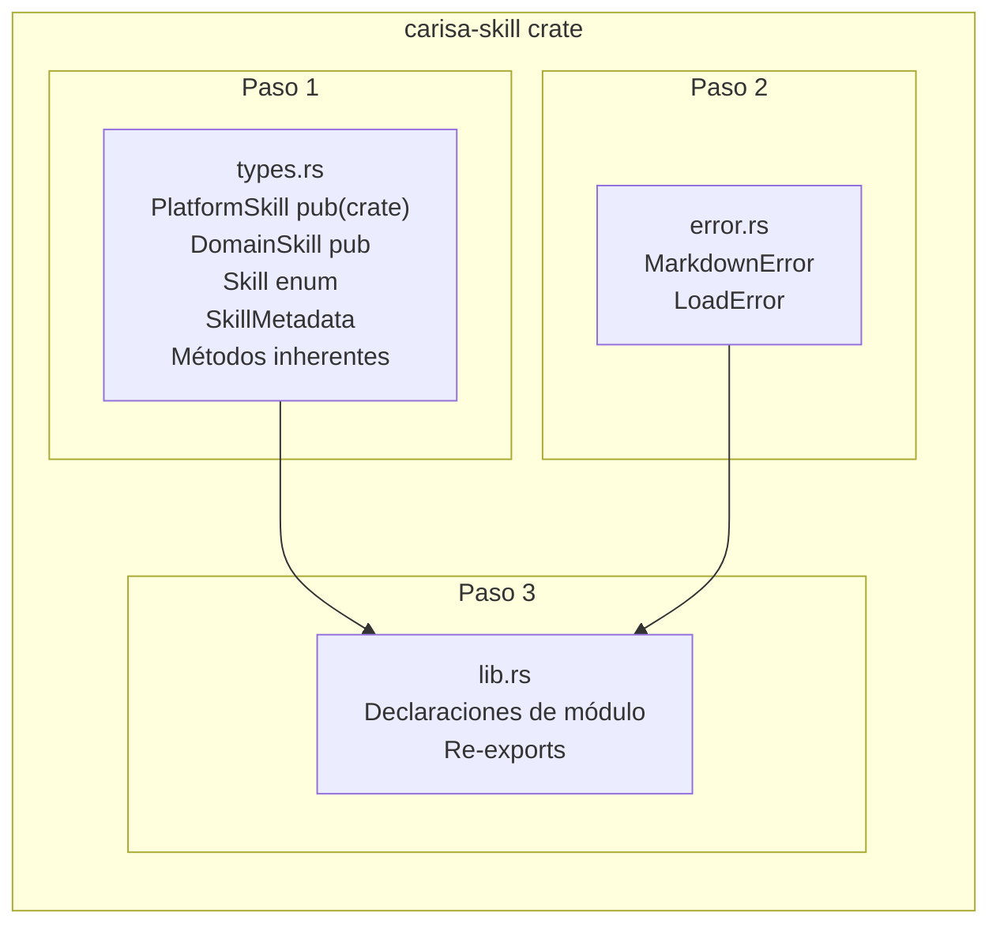

# T1: Tipos de datos y errores

**Creada**: 2026-06-18
**Estado**: Implementada

---

## Instrucciones para el agente codificador

1. **Carga el skill `coder`** antes de empezar cualquier implementación. Sigue su guía.

2. **Cambia el estado** del plan en el encabezado según la fase en la que estés:
   - Al **terminar** exitosamente la codificación: cambia `**Estado**: En codificación` por `**Estado**: Implementada`.
   - Si durante la codificación necesitas **modificar el plan detallado**, **no lo hagas tú**. Informa al usuario indicando que es necesario que cambie manualmente al agente `@spec/plan` y explícale los ajustes que el plan necesita y el motivo.

3. **Sigue el plan detallado** que aparece a continuación. Es la fuente de verdad de lo que hay que implementar. Si encuentras una contradicción insalvable con el código real, resuélvela con el desarrollador. Si la solución requiere cambios en el plan, aplica el punto 2.

4. **No modifiques** esta sección de instrucciones.

---

## Plan detallado de implementación

### Contexto de la tarea

T1 es la tarea fundacional del crate `carisa-skill`. Define los tipos de datos
y los errores sobre los que se construyen T2, T3 y T4. No tiene prerrequisitos.
El crate `carisa-skill` tiene las dependencias necesarias ya declaradas en
`Cargo.toml`: `derive_builder 0.20`, `thiserror 2`, `serde 1` (con feature
`derive`), `serde-saphyr 0.0.28`.

### Diagrama de artefactos creados en esta tarea



### Paso 0 — Corregir `Cargo.toml`

El archivo `carisa/skill/Cargo.toml` declara `[lib] name = "carisa"`, lo cual
fuerza el nombre de librería a `carisa` en lugar de usar la convención estándar
(paquete `carisa-skill` → librería `carisa_skill`).

**Eliminar la sección `[lib]` completa**:

```toml
[lib]
name = "carisa"
path = "src/lib.rs"
```

Tras eliminar estas 3 líneas, Cargo usará el valor por defecto: el nombre del
paquete con guiones reemplazados por underscores → `carisa_skill`. El path
`src/lib.rs` ya es el valor por defecto.

El archivo debe quedar con estas secciones (sin `[lib]`):

```toml
[package]
name = "carisa-skill"
...

[dependencies]
...

[lints]
workspace = true
```

---

### Paso 1 — Crear `types.rs`

Crear el archivo `carisa/skill/src/types.rs` con el siguiente contenido.

#### 1.1 Imports necesarios

```rust
use derive_builder::Builder;
use serde::{Deserialize, Serialize};
```

#### 1.2 Estructura `PlatformSkill` (visibilidad `pub`)

```rust
/// A skill defined and pre-installed by the Carisa platform core.
///
/// Platform skills are managed internally by the core and cannot
/// be registered from external domain code.
///
/// The `always_load` flag signals that this skill should be loaded
/// automatically into every agent session without being requested
/// explicitly via the catalog.
#[derive(Builder, Debug, Clone, Serialize, Deserialize)]
#[builder(pattern = "owned")]
pub struct PlatformSkill {
    /// Unique identifier for this skill (e.g. `"coder"`).
    id: String,
    /// Human-readable title (e.g. `"Expert Coder"`).
    title: String,
    /// Short description shown in the skill catalog.
    description: String,
    /// Full instructions injected into the agent context when loaded.
    instructions: String,
    /// If `true`, this skill loads automatically into every agent session.
    always_load: bool,
}
```

**Puntos clave:**
- El struct es `pub`, igual que su builder (por defecto, `derive_builder` iguala la
  visibilidad del builder a la del struct).
- Deriva `Debug`, `Clone`, `Serialize`, `Deserialize` según RT-007.
- Campos privados; el acceso se realiza vía métodos inherentes.

#### 1.2b Métodos inherentes de `PlatformSkill`

Añadir justo después de la definición del struct (antes de `DomainSkill`):

```rust
impl PlatformSkill {
    /// Returns the skill's unique identifier.
    pub fn id(&self) -> &str {
        &self.id
    }
    /// Returns the human-readable title.
    pub fn title(&self) -> &str {
        &self.title
    }
    /// Returns the short description.
    pub fn description(&self) -> &str {
        &self.description
    }
    /// Returns the full instructions string.
    pub fn instructions(&self) -> &str {
        &self.instructions
    }
    /// Returns `true` if this skill should be auto-loaded into every
    /// agent session.
    pub(crate) fn always_load(&self) -> bool {
        self.always_load
    }
}
```

**Puntos clave:**
- Bloque `impl` separado del Builder (que es generado por `derive_builder`). Esto
  evita que `derive_builder` intente generar setters para métodos que no son campos.
- `always_load()` es `pub(crate)`: solo accesible desde dentro del crate (manager
  en T4, tests internos). No se expone en la API pública.
- Despacho estático, zero-cost.

#### 1.3 Estructura `DomainSkill` (visibilidad `pub`)

```rust
/// A skill defined by a domain developer or loaded from markdown.
///
/// Constructed using [`DomainSkillBuilder`] (generated by
/// `derive_builder`).
#[derive(Builder, Debug, Clone, Serialize, Deserialize)]
#[builder(pattern = "owned")]
pub struct DomainSkill {
    /// Unique identifier for this skill (e.g. `"my-custom-skill"`).
    pub(crate) id: String,
    /// Human-readable title (e.g. `"My Custom Skill"`).
    pub(crate) title: String,
    /// Short description shown in the skill catalog.
    pub(crate) description: String,
    /// Full instructions injected into the agent context when loaded.
    pub(crate) instructions: String,
}
```

**Puntos clave:**
- El struct es `pub`, igual que su builder (por defecto, `derive_builder` iguala la
  visibilidad del builder a la del struct).
- Campos con visibilidad `pub(crate)`: necesaria para que `from_markdown` en
  `markdown.rs` (T3) pueda construir `DomainSkill` directamente,
  sin depender del Builder. Los métodos inherentes son la API pública.
- Sin campo `always_load` — la distinción estructural entre `PlatformSkill` y
  `DomainSkill` es lo que garantiza BR-008 y CL-01.
- Mismas derivas que `PlatformSkill`.

#### 1.3b Métodos inherentes de `DomainSkill`

Añadir justo después de la definición del struct:

```rust
impl DomainSkill {
    /// Returns the skill's unique identifier.
    pub fn id(&self) -> &str {
        &self.id
    }
    /// Returns the human-readable title.
    pub fn title(&self) -> &str {
        &self.title
    }
    /// Returns the short description.
    pub fn description(&self) -> &str {
        &self.description
    }
    /// Returns the full instructions string.
    pub fn instructions(&self) -> &str {
        &self.instructions
    }
}
```

**Puntos clave:**
- Bloque `impl` separado del Builder generado por `derive_builder`.
- Métodos públicos: constituyen la API para consumidores externos.
- Despacho estático, zero-cost.

#### 1.4 ~~Trait `SkillMeta`~~ (ELIMINADO)

> **Cambio 2026-06-26**: El trait `SkillMeta` y sus implementaciones para
> `PlatformSkill` y `DomainSkill` se han eliminado. La API pública ahora
> se compone de métodos inherentes definidos en bloques `impl` separados
> para cada tipo. Ver secciones 1.2b, 1.3b y 1.5b.

#### 1.5 `enum Skill`

```rust
/// Homogeneous storage for platform and domain skills.
///
/// Wraps both [`PlatformSkill`] and [`DomainSkill`] into a single
/// type for storage in a single `HashMap`. Avoids dynamic dispatch
/// (`dyn Trait`) and its associated heap allocation.
#[derive(Debug, Clone)]
#[non_exhaustive]
pub enum Skill {
    /// A platform-defined skill (core-only).
    Platform(PlatformSkill),
    /// A user-defined or markdown-loaded skill.
    Domain(DomainSkill),
}
```

**Puntos clave:**
- `pub enum` con variantes `pub` implícitamente.
- No deriva `Serialize`/`Deserialize` porque no es necesario para el alcance
  actual y añadiría complejidad innecesaria (habría que usar `serde(tag = "...")`
  para las variantes).
- `Debug` y `Clone` son necesarios para el manager.

#### 1.5b Métodos inherentes de `enum Skill`

Añadir justo después de la definición del enum:

```rust
impl Skill {
    /// Returns the skill's unique identifier.
    pub fn id(&self) -> &str {
        match self {
            Skill::Platform(p) => p.id(),
            Skill::Domain(d) => d.id(),
        }
    }
    /// Returns the human-readable title.
    pub fn title(&self) -> &str {
        match self {
            Skill::Platform(p) => p.title(),
            Skill::Domain(d) => d.title(),
        }
    }
    /// Returns the short description.
    pub fn description(&self) -> &str {
        match self {
            Skill::Platform(p) => p.description(),
            Skill::Domain(d) => d.description(),
        }
    }
    /// Returns the full instructions string.
    pub fn instructions(&self) -> &str {
        match self {
            Skill::Platform(p) => p.instructions(),
            Skill::Domain(d) => d.instructions(),
        }
    }
}
```

**Puntos clave:**
- Cada método hace `match` sobre las variantes y delega en el método
  inherente correspondiente del tipo interno.
- Cero coste: sin dynamic dispatch, sin heap allocation. El compilador
  resuelve las llamadas estáticamente.
- Permite que el manager (T4) y otros consumidores trabajen con `&Skill`
  sin necesidad de hacer `match` manualmente para acceder a `id`, `title`,
  `description` o `instructions`.

#### 1.6 `SkillMetadata`

```rust
/// Lightweight catalog entry containing only the id and description.
///
/// Skills where `always_load` is `true` are excluded from the catalog,
/// as they are loaded automatically and should not appear in the
/// user-facing catalog.
#[derive(Debug, Clone, Serialize)]
#[non_exhaustive]
pub struct SkillMetadata {
    /// Skill identifier.
    pub id: String,
    /// Short description.
    pub description: String,
}
```

**Puntos clave:**
- Campos `pub` porque `SkillMetadata` es un DTO plano sin invariantes.
- Deriva `Serialize` según RT-007 (para posibles bindings o serialización futura).
- No deriva `Deserialize` — no se construye desde fuera.

#### 1.7 Tests unitarios en `types.rs`

Añadir al final del archivo, dentro de un módulo `#[cfg(test)]`:

```rust
#[cfg(test)]
mod tests {
    use super::*;

    // T1-CP1: PlatformSkill inherent methods return assigned values
    #[test]
    fn platform_skill_inherent_methods_return_values() {
        let skill = PlatformSkillBuilder::default()
            .id("ps1".to_string())
            .title("Platform Title".to_string())
            .description("Platform Desc".to_string())
            .instructions("Platform Instructions".to_string())
            .always_load(true)
            .build()
            .expect("all fields provided");
        assert_eq!(skill.id(), "ps1");
        assert_eq!(skill.title(), "Platform Title");
        assert_eq!(skill.description(), "Platform Desc");
        assert_eq!(skill.instructions(), "Platform Instructions");
        assert!(skill.always_load());
    }

    // T1-CP2: DomainSkill inherent methods return assigned values
    #[test]
    fn domain_skill_inherent_methods_return_values() {
        let skill = DomainSkillBuilder::default()
            .id("ds1".to_string())
            .title("Domain Title".to_string())
            .description("Domain Desc".to_string())
            .instructions("Domain Instructions".to_string())
            .build()
            .expect("all fields provided");
        assert_eq!(skill.id(), "ds1");
        assert_eq!(skill.title(), "Domain Title");
        assert_eq!(skill.description(), "Domain Desc");
        assert_eq!(skill.instructions(), "Domain Instructions");
    }

    // T1-CP3: DomainSkill has no always_load field
    //         Verified at compile time: uncommenting the line below
    //         would cause a compile error.
    #[test]
    fn domain_skill_has_no_always_load_field() {
        let skill = DomainSkillBuilder::default()
            .id("x".to_string())
            .title("t".to_string())
            .description("d".to_string())
            .instructions("i".to_string())
            .build()
            .expect("all fields provided");
        // Accessing skill.always_load would not compile.
        // This test proves the struct can be built and used without it.
        let _ = skill;
    }

    // T1-CP4: SkillMetadata can be constructed and fields are accessible
    #[test]
    fn skill_metadata_construction_and_access() {
        let meta = SkillMetadata {
            id: "test-id".to_string(),
            description: "test-desc".to_string(),
        };
        assert_eq!(meta.id, "test-id");
        assert_eq!(meta.description, "test-desc");
    }

    // T1-CP5: enum Skill accepts both variants
    #[test]
    fn skill_enum_accepts_both_variants() {
        let platform = PlatformSkillBuilder::default()
            .id("p".to_string())
            .title("t".to_string())
            .description("d".to_string())
            .instructions("i".to_string())
            .always_load(false)
            .build()
            .expect("all fields provided");
        let domain = DomainSkillBuilder::default()
            .id("d".to_string())
            .title("t".to_string())
            .description("d".to_string())
            .instructions("i".to_string())
            .build()
            .expect("all fields provided");

        let _p = Skill::Platform(platform);
        let _d = Skill::Domain(domain);

        // Test pattern matching exhaustiveness (compile-time guarantee)
        let desc = |s: &Skill| match s {
            Skill::Platform(ps) => ps.description().to_string(),
            Skill::Domain(ds) => ds.description().to_string(),
        };
        assert_eq!(desc(&_p), "d");
        assert_eq!(desc(&_d), "d");
    }
}
```

**Nota sobre T1-CP3:** el caso de prueba original exige que `DomainSkill`
no compile si se intenta acceder a `always_load`. Dado que el campo no
existe en el struct, cualquier intento de acceso es un error de compilación
directo. El test aquí presente documenta que la construcción funciona sin
ese campo, lo cual es suficiente para verificar el invariante estructural.
No se usa `compile_fail` porque requiere la crate `trybuild` como
dependencia de desarrollo, lo cual excede el alcance de T1.

---

### Paso 2 — Crear `error.rs`

Crear el archivo `carisa/skill/src/error.rs` con los tipos de error definidos
mediante `thiserror`.

#### 2.1 Import necesario

```rust
use thiserror::Error;
```

#### 2.2 `MarkdownError`

Cuatro variantes, todas con `id: Option<String>` y `title: Option<String>` como
campos de contexto. La variante `YamlParse` almacena el mensaje de error YAML
como `msg: String` en lugar de incrustar `serde_saphyr::Error`, lo que reduce
el tamaño del enum (`clippy::result_large_err`) y permite derivar `PartialEq`.

El `Display` se implementa manualmente (no con `#[error("...")]`) porque los
mensajes incluyen condicionalmente el `id`:

```rust
/// Error produced when parsing a skill from a markdown string.
///
/// All variants carry `id` and `title` context fields
/// (`Option<String>`) to enrich error messages when the
/// frontmatter has been partially parsed.
#[derive(Error, Debug, PartialEq)]
#[non_exhaustive]
pub enum MarkdownError {
    /// The YAML frontmatter contains invalid syntax.
    YamlParse {
        /// Skill id, if parsed before the error occurred.
        id: Option<String>,
        /// Skill title, if parsed before the error occurred.
        title: Option<String>,
        /// Human-readable YAML parse error.
        msg: String,
    },
    /// A required field is missing from the frontmatter.
    MissingField {
        /// Skill id, if parsed.
        id: Option<String>,
        /// Skill title, if parsed.
        title: Option<String>,
        /// Name of the missing field (`"id"`, `"title"`, or `"description"`).
        field: String,
    },
    /// The markdown body after the frontmatter is empty or whitespace-only.
    EmptyBody {
        /// Skill id, if parsed.
        id: Option<String>,
        /// Skill title, if parsed.
        title: Option<String>,
    },
    /// The markdown input does not have the expected `---` delimiters
    /// around the YAML frontmatter.
    InvalidDelimiters {
        /// Skill id, if parsed.
        id: Option<String>,
        /// Skill title, if parsed.
        title: Option<String>,
    },
}
```

#### 2.3 `Display` manual para `MarkdownError`

```rust
impl std::fmt::Display for MarkdownError {
    fn fmt(&self, f: &mut std::fmt::Formatter<'_>) -> std::fmt::Result {
        match self {
            Self::YamlParse { id, title: _, msg } => {
                if let Some(id) = id {
                    write!(
                        f,
                        "Failed to parse YAML frontmatter for skill \
                         '{id}': {msg}"
                    )
                } else {
                    write!(f, "Failed to parse YAML frontmatter: {msg}")
                }
            }
            Self::MissingField {
                id,
                title: _,
                field,
            } => {
                if let Some(id) = id {
                    write!(
                        f,
                        "Missing required field '{field}' for skill '{id}'"
                    )
                } else {
                    write!(f, "Missing required field '{field}'")
                }
            }
            Self::EmptyBody { id, title: _ } => {
                if let Some(id) = id {
                    write!(f, "Skill '{id}' has an empty body")
                } else {
                    write!(f, "Skill has an empty body")
                }
            }
            Self::InvalidDelimiters { id, title: _ } => {
                if let Some(id) = id {
                    write!(
                        f,
                        "Invalid markdown delimiters for skill '{id}'"
                    )
                } else {
                    write!(f, "Invalid markdown delimiters")
                }
            }
        }
    }
}
```

#### 2.4 `LoadError`

```rust
/// Error returned when a requested skill id is not found in the manager.
#[derive(Error, Debug, Clone, PartialEq, Eq)]
#[non_exhaustive]
#[error("Skill '{id}' not found")]
pub struct LoadError {
    /// The id that was requested but not found.
    pub id: String,
}
```

**Nota:** `LoadError` es un struct (no enum) porque solo tiene una variante.
Esto permite que el `id` sea accesible directamente desde el exterior
(`err.id`) para que el llamador pueda inspeccionar qué `id` falló.

#### 2.5 Tests unitarios en `error.rs`

```rust
#[cfg(test)]
mod tests {
    use super::*;

    // T1-CP6: MarkdownError::YamlParse with id: Some("x")
    //         Display includes the id
    #[test]
    fn yaml_parse_with_id_includes_id_in_display() {
        // Build a fake YAML error
        let bad_yaml = "id: x\n  bad indentation";
        let yaml_err =
            serde_saphyr::from_str::<serde_saphyr::Value>(bad_yaml)
                .unwrap_err();
        let err = MarkdownError::YamlParse {
            id: Some("x".to_string()),
            title: Some("T".to_string()),
            msg: yaml_err.to_string(),
        };
        let msg = err.to_string();
        assert!(
            msg.contains("skill 'x'"),
            "Display should contain skill id 'x', got: {msg}"
        );
    }

    // T1-CP7: MarkdownError::MissingField with id: None
    //         Display is readable without id
    #[test]
    fn missing_field_without_id_is_readable() {
        let err = MarkdownError::MissingField {
            id: None,
            title: None,
            field: "description".to_string(),
        };
        let msg = err.to_string();
        assert!(
            msg.contains("Missing required field 'description'"),
            "Display should mention the missing field, got: {msg}"
        );
        assert!(
            !msg.contains("for skill"),
            "Display should not mention 'for skill' when id is None, \
             got: {msg}"
        );
    }

    // T1-CP8: LoadError::NotFound includes id in Display
    #[test]
    fn load_error_not_found_includes_id_in_display() {
        let err = LoadError {
            id: "my-skill".to_string(),
        };
        let msg = err.to_string();
        assert!(
            msg.contains("'my-skill'"),
            "Display should contain the skill id, got: {msg}"
        );
    }

    // Additional: verify YamlParse without id is readable
    #[test]
    fn yaml_parse_without_id_is_readable() {
        let bad_yaml = ":::";
        let yaml_err =
            serde_saphyr::from_str::<serde_saphyr::Value>(bad_yaml)
                .unwrap_err();
        let err = MarkdownError::YamlParse {
            id: None,
            title: None,
            msg: yaml_err.to_string(),
        };
        let msg = err.to_string();
        assert!(
            msg.starts_with("Failed to parse YAML frontmatter:"),
            "Display should start with the error description, got: {msg}"
        );
    }

    // Additional: verify EmptyBody and InvalidDelimiters format correctly
    #[test]
    fn empty_body_format() {
        let with_id = MarkdownError::EmptyBody {
            id: Some("x".to_string()),
            title: None,
        };
        assert!(with_id.to_string().contains("skill 'x'"));

        let without_id = MarkdownError::EmptyBody {
            id: None,
            title: None,
        };
        assert!(!without_id.to_string().contains("for skill"));
    }

    #[test]
    fn invalid_delimiters_format() {
        let err = MarkdownError::InvalidDelimiters {
            id: Some("y".to_string()),
            title: None,
        };
        assert!(err.to_string().contains("skill 'y'"));
    }

    // Verify MarkdownError implements std::error::Error
    #[test]
    fn markdown_error_implements_std_error() {
        fn _assert_error<T: std::error::Error>() {}
        _assert_error::<MarkdownError>();
    }

    // Verify LoadError implements std::error::Error
    #[test]
    fn load_error_implements_std_error() {
        fn _assert_error<T: std::error::Error>() {}
        _assert_error::<LoadError>();
    }
}
```

---

### Paso 3 — Reescribir `lib.rs`

Reemplazar **todo** el contenido actual de `carisa/skill/src/lib.rs` por lo
siguiente. El archivo actual contiene código dummy (función `add`, tests
triviales, `pub mod skill;` inexistente) que debe eliminarse por completo.

#### 3.1 Contenido del nuevo `lib.rs`

```rust
//! # Carisa Skill
//!
//! Skill definition, loading, and registration crate for the Carisa
//! agent orchestration platform.
//!
//! This crate provides:
//!
//! - [`DomainSkill`] — user-defined skills, buildable via
//!   [`DomainSkillBuilder`] or parsed from markdown.
//! - [`PlatformSkill`] — platform-defined skills with auto-load
//!   capability (pub(crate)).
//! - [`Skill`] enum — homogeneous storage for platform and domain skills
//!   with inherent methods (`id()`, `title()`, `description()`,
//!   `instructions()`).
//! - [`SkillMetadata`] — lightweight catalog entry (id + description).
//! - [`MarkdownError`] and [`LoadError`] — error types.
//!
//! # Example
//!
//! ```rust
//! use carisa_skill::DomainSkillBuilder;
//!
//! let skill = DomainSkillBuilder::default()
//!     .id("my-skill".to_string())
//!     .title("My Skill".to_string())
//!     .description("Does something useful".to_string())
//!     .instructions("Step 1: ...".to_string())
//!     .build()
//!     .expect("all required fields set");
//!
//! assert_eq!(skill.id(), "my-skill");
//! ```

pub mod error;
pub mod markdown;
pub mod types;

// ── Re-exports: public API ──────────────────────────────────────────

pub use error::{LoadError, MarkdownError};
pub use types::{
    DomainSkill, DomainSkillBuilder, Skill, SkillMetadata,
};
```

#### 3.2 Notas importantes

- **No** se declara `pub mod skill;` — el módulo `skill` del código dummy no
  existe y debe eliminarse.
- **No** se re-exporta `PlatformSkill` ni `PlatformSkillBuilder` — son
  `pub(crate)` en `types.rs` y se usan solo desde dentro del crate.
- El `#![deny(missing_docs)]` anterior se elimina porque el workspace ya
  aplica `missing_docs = deny` vía `[lints] workspace = true`. Mantenerlo
  sería redundante.
- `missing_crate_level_docs = deny` está activo en el workspace; el `//!`
  inicial satisface este requisito.
- El doc comment `//!` incluye un ejemplo funcional con `DomainSkillBuilder`;
  esto servirá como doctest automático.

#### 3.3 Verificación

Tras escribir los tres archivos (`types.rs`, `error.rs`, `lib.rs`), el
codificador debe ejecutar:

```bash
cargo check -p carisa-skill
```

El comando debe compilar sin errores. Si falla con errores de `missing_docs`,
revisar que todos los ítems públicos y sus campos/variantes tengan doc
comments `///`.

El codificador también debe ejecutar los tests:

```bash
cargo test -p carisa-skill
```

Y finalmente las validaciones completas:

```bash
cargo fmt
cargo check -p carisa-skill
cargo clippy -p carisa-skill -- -D warnings
cargo doc -p carisa-skill --no-deps
cargo test -p carisa-skill
```

Todas deben pasar sin errores ni warnings.

**Nota**: si el crate ya contiene código de T2 y T3 (como es el caso actual),
ejecutar `cargo test -p carisa-skill` es seguro: los tests de todas las
tareas deben pasar. El codificador no debe eliminar código de tareas
posteriores.

---

### Notas técnicas y advertencias

1. **Forward-links eliminados**: las referencias intra-doc a tipos que no
   existen en T1 (`SkillManager`, `from_markdown`) se han omitido. El
   workspace tiene `broken_intra_doc_links = deny` y esos links romperían
   la compilación. Se añadirán en T3 y T4 cuando los tipos destino estén
   disponibles.

2. **`missing_docs = deny`**: todos los ítems `pub` y `pub(crate)` deben
   tener doc comment `///`. Esto incluye variantes de enum (aunque sean
   implícitamente `pub`), campos `pub` de structs, y métodos inherentes
   públicos.
   Los campos privados no requieren doc comment pero se recomienda
   incluirlos para claridad interna.

3. **`unwrap_used = deny`**: no se permite `.unwrap()` en código de
   producción. Los tests sí pueden usar `.unwrap()` y `.expect()`.
   Los builders devuelven `Result`; en producción debe propagarse con `?`.

4. **`unsafe_code = deny`**: no se permite código `unsafe`. Ninguno de
   los artefactos de T1 lo requiere.

5. **`clone_on_ref_ptr` / `str_to_string`**: clippy advierte sobre clones
   innecesarios. Al construir builders, los `.to_string()` sobre literales
   son necesarios porque los campos son `String` (owned). No suprimir
   estas advertencias; son aceptables en este contexto.

6. **`MarkdownError` deriva `PartialEq`**: la variante `YamlParse` almacena
   `msg: String` en lugar de `serde_saphyr::Error`. Al ser `String` un tipo
   que implementa `PartialEq` y `Eq`, el enum completo puede derivar ambas
   traits sin restricciones. Esto permite usar `assert_eq!` en tests en
   lugar de `matches!()`, simplificando las verificaciones. El cambio
   también resuelve `clippy::result_large_err` porque `serde_saphyr::Error`
   (~152 bytes) se reemplaza por `String` (24 bytes en stack).

7. **Los builders se generan, no se escriben**: `DomainSkillBuilder` y
   `PlatformSkillBuilder` son tipos generados automáticamente por la macro
   `#[derive(Builder)]` de `derive_builder`. No deben declararse
   manualmente. El codificador debe verificar que `cargo doc` los incluye
   correctamente en la documentación generada.

8. **Dependencia `rstest`**: el `Cargo.toml` incluye `rstest = "0.26.1"` en
   `[dev-dependencies]`. Aunque los tests de T1 no lo usan (sí lo harán T2+),
   su presencia no causa problemas de compilación y es correcto mantenerla.

9. **Nombre de librería corregido**: el `Cargo.toml` original forzaba
   `[lib] name = "carisa"`. Se ha eliminado esa sección para que el nombre
   de librería sea `carisa_skill` (convención estándar: guiones → underscores).
   El doctest en `lib.rs` usa `carisa_skill` como nombre externo.

10. **Impacto en T3 (`markdown.rs`)**: el archivo `markdown.rs` (implementado
    en T3) importa actualmente `use crate::types::SkillMeta`. Al eliminar el
    trait en T1, este import romperá la compilación de `markdown.rs`. El
    `cambios/tasks-plan.md` ya contempla el ajuste necesario para T3 (entrada
    del 2026-06-26). El codificador de T1 NO debe modificar `markdown.rs`;
    ese ajuste corresponde al agente de T3.
