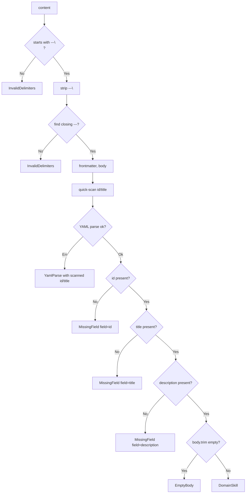

# T3: Constructor desde markdown

**Creada**: 2026-06-24
**Estado**: Implementada

---

## Instrucciones para el agente codificador

1. **Carga el skill `coder`** antes de empezar cualquier implementación. Sigue su guía.

2. **Cambia el estado** del plan en el encabezado según la fase en la que estés:
   - Al **terminar** exitosamente la codificación: cambia `**Estado**: En codificación` por `**Estado**: Implementada`.
   - Durante la codificación, si el plan necesita ajustes:
    - Si son cambios menores o locales, puedes aplicarlos directamente.
    - Si son modificaciones estructurales o de arquitectura, no las hagas tú: informa al usuario y pídele que cambie al agente `@spec/plan`, explicando los ajustes necesarios y su motivo.

3. **Sigue el plan detallado** que aparece a continuación. Es la fuente de verdad de lo que hay que implementar. Si encuentras una contradicción insalvable con el código real, resuélvela con el desarrollador. Si la solución requiere cambios en el plan, aplica el punto 2.

4. No uses códigos del tipo Letra+Número (T1, T2, CP1) en la documentación. Usa siempre nombres completos y semánticos.

5. **No modifiques** esta sección de instrucciones.

---

## Plan detallado de implementación

### Resumen

Esta tarea implementa `DomainSkill::from_markdown(content: &str)
-> Result<DomainSkill, MarkdownError>`, un constructor asociado que
parsea una cadena markdown con frontmatter YAML delimitado por
`---` y construye un `DomainSkill`. Los tipos de datos y errores
ya existen (T1 implementada). La dependencia `serde-saphyr` ya
está en `Cargo.toml`.

**Archivos a modificar**:
- `carisa/skill/src/markdown.rs` — implementación y tests
  (ya existente; verificar que coincide con este plan)

**Archivos ya modificados (no requieren cambios)**:
- `carisa/skill/src/types.rs` — campos de `DomainSkill` ya
  tienen visibilidad `pub(crate)`
- `carisa/skill/src/lib.rs` — `pub mod markdown;` ya
  declarado

---

### Paso 1 — Verificar visibilidad de campos en `DomainSkill`

En `carisa/skill/src/types.rs`, los cuatro campos de
`DomainSkill` ya deben tener visibilidad `pub(crate)` para que
`markdown.rs` pueda construir la struct directamente mediante
la sintaxis de inicialización de struct, sin depender del
Builder:

```rust
pub(crate) id: String,
pub(crate) title: String,
pub(crate) description: String,
pub(crate) instructions: String,
```

Si los campos ya tienen esta visibilidad, no se requiere
ninguna modificación en `types.rs`.

Los campos de `PlatformSkill` no se modifican; siguen privados
al módulo.

---

### Paso 2 — Crear `carisa/skill/src/markdown.rs`

#### Estructura del archivo

1. Documentación del módulo (`//!`)
2. Función auxiliar privada `quick_extract_field`
3. Dos funciones auxiliares privadas: `split_frontmatter` y
   `extract_field`
4. Bloque `impl DomainSkill` con el método público
   `from_markdown`
5. Módulo `#[cfg(test)] mod tests` con todos los casos de
   prueba (ver Paso 4)

#### Función auxiliar: `quick_extract_field`

**Firma**: `fn quick_extract_field(yaml: &str, field: &str)
-> Option<String>`

**Propósito**: Extracción best-effort de un valor YAML para
usarlo como contexto en mensajes de error. No es un parser
YAML completo; solo escanea líneas buscando `field: valor`.

**Algoritmo**:
1. Recorrer cada línea del string `yaml`.
2. Eliminar whitespace inicial de la línea.
3. Si la línea empieza por `"{field}:"`, extraer el resto tras
   los dos puntos y aplicarle `.trim()`.
4. Si el resto está vacío, devolver `None`.
5. Si el resto empieza y termina con `"`, devolver el
   contenido interior sin las comillas.
6. Si el resto empieza y termina con `'`, devolver el
   contenido interior sin las comillas simples.
7. Si no, tomar la parte antes del primer `#` (comentario
   inline), aplicarle `.trim()`, y devolverla si no está
   vacía.
8. Si ninguna línea coincide, devolver `None`.

#### Función auxiliar: `split_frontmatter`

**Firma**: `fn split_frontmatter(content: &str) ->
Result<(&str, &str), MarkdownError>`

**Propósito**: Separar el frontmatter YAML del cuerpo de
instrucciones usando los delimitadores `---`.

**Algoritmo**:
1. Verificar que `content` empieza por `"---\n"` o
   `"---\r\n"`. Si no, devolver
   `Err(MarkdownError::InvalidDelimiters { id: None,
   title: None })`. Almacenar el resto tras el prefijo.
2. Buscar en el resto la primera ocurrencia de `"\n---\n"`.
   Si se encuentra, el frontmatter es la parte anterior a esa
   posición y el body es la parte posterior (saltando los 5
   bytes del separador).
3. Si no, buscar `"\n---\r\n"`. Misma lógica, saltando 6 bytes.
4. Si no, comprobar si el resto termina en `"\n---"`. Si es
   así, el body es `""` (vacío).
5. Si ninguna de las anteriores, devolver
   `Err(MarkdownError::InvalidDelimiters { id: None,
   title: None })`.

#### Función auxiliar: `extract_field`

**Firma**: `fn extract_field(yaml: &str, field: &str)
-> Option<String>`

**Propósito**: Extraer un campo con valor string del
frontmatter YAML mediante parseo línea a línea. No usa
`serde_saphyr::Value`; es un parser de strings simple y
autosuficiente.

**Algoritmo**:
1. Recorrer cada línea del string `yaml`.
2. Para cada línea, eliminar whitespace inicial.
3. Si la línea empieza por `"{field}:"`, extraer el resto
   tras los dos puntos y aplicar `.trim()`.
4. Si el resto está vacío, devolver `None`.
5. Si el resto empieza y termina con `"`, devolver el
   contenido interior sin las comillas.
6. Si el resto empieza y termina con `'`, devolver el
   contenido interior sin las comillas simples.
7. Detectar valores YAML no-string: si el resto coincide
   (case-insensitive) con `true`, `false`, `yes`, `no`,
   `on`, `off` (booleanos) o `~`, `null` (null), o si es
   parseable como `i64` o `f64` (número), devolver `None`.
8. Eliminar comentarios inline (texto tras `#`), aplicar
   `.trim()`, y devolver el resultado si no está vacío.
9. Si ninguna línea coincide, devolver `None`.

**Nota**: Esta función es distinta de `quick_extract_field`
porque además de extraer valores, rechaza explícitamente
valores YAML no-string (booleanos, null, números). Esto
permite que campos como `id: 123` o `title: true` produzcan
errores `MissingField` en lugar de ser aceptados
incorrectamente como strings.

#### Método público: `DomainSkill::from_markdown`

**Firma**:
```rust
impl DomainSkill {
    pub fn from_markdown(
        content: &str,
    ) -> Result<Self, MarkdownError>;
}
```

**Documentación**: Describir en doc comments de rustdoc:
- Qué hace el método y qué formato de entrada espera
  (`---\n` + YAML + `\n---\n` + cuerpo).
- Secciones `# Errors` detallando cada variante de
  `MarkdownError` que puede devolver y cuándo.

**Algoritmo** (8 pasos, ver diagrama abajo):

1. **Split de delimitadores**: llamar a
   `split_frontmatter(content)` para obtener `(frontmatter,
   body)` como dos `&str`. Propagar el error con `?`.

2. **Quick-scan para contexto de error**: llamar a
   `quick_extract_field(frontmatter, "id")` y
   `quick_extract_field(frontmatter, "title")`. Guardar los
   resultados como `scanned_id` y `scanned_title` (ambos
   `Option<String>`).

3. **Parseo YAML (solo validación)**: llamar a
   `serde_saphyr::from_str::<serde::de::IgnoredAny>(frontmatter)`.
   Esto valida que el frontmatter sea YAML sintácticamente
   válido, pero descarta el resultado (no se usa
   `serde_saphyr::Value` para extraer campos). Si falla,
   mapear el error a
   `MarkdownError::YamlParse { id: scanned_id, title:
   scanned_title, msg: error.to_string() }` y devolver `Err`.

4. **Extraer `id`**: llamar a `extract_field(frontmatter, "id")`.
   Si es `None`, devolver
   `Err(MarkdownError::MissingField { id: scanned_id, title:
   scanned_title, field: "id".to_owned() })`. Si es `Some`,
   desempaquetar.

5. **Extraer `title`**: llamar a
   `extract_field(frontmatter, "title")`. Si es `None`, devolver
   `Err(MarkdownError::MissingField { id: Some(id.clone()),
   title: None, field: "title".to_owned() })`. Si es `Some`,
   desempaquetar. Nótese que aquí `id` ya está disponible para
   el contexto del error.

6. **Extraer `description`**: llamar a
   `extract_field(frontmatter, "description")`. Si es `None`,
   devolver `Err(MarkdownError::MissingField { id:
   Some(id.clone()), title: Some(title.clone()), field:
   "description".to_owned() })`. Si es `Some`, desempaquetar.

7. **Validar cuerpo no vacío**: aplicar `.trim()` a `body`. Si
   el resultado es una cadena vacía (`""`), devolver
   `Err(MarkdownError::EmptyBody { id: Some(id), title:
   Some(title) })`.

8. **Construir y devolver**: construir `DomainSkill` con
   sintaxis de inicialización de struct:
   `DomainSkill { id, title, description, instructions:
   body_trimmed.to_owned() }`. Devolver `Ok(skill)`.

#### Diagrama de flujo del algoritmo



---

### Paso 3 — Verificar `lib.rs`

En `carisa/skill/src/lib.rs`, verificar que la declaración del
módulo `markdown` ya existe (`pub mod markdown;`). Si no
existe, añadirla después de `pub mod error;`. El orden
concreto debe ser: `pub mod error;`, `pub mod markdown;`,
`pub mod types;`.

No es necesario re-exportar `from_markdown` por separado porque
es un método asociado de `DomainSkill`, que ya está
re-exportado.

---

### Paso 4 — Tests

Todos los tests se escriben en el módulo `#[cfg(test)] mod
tests` al final de `carisa/skill/src/markdown.rs`. Se usa
`rstest` para los casos parametrizados (DDT).

**Imports necesarios**: `use super::*`, `use
crate::error::MarkdownError`, `use rstest::rstest`.

---

#### Tests de éxito

**Test: markdown válido con todos los campos** (cubre T3-CP1)

- **Input**: string markdown con frontmatter que contiene `id:
  my-skill`, `title: My Skill`, `description: Does useful
  things` y cuerpo `Step 1: initialize\nStep 2: execute`.
- **Llamada**:
  `DomainSkill::from_markdown(input).expect("valid markdown")`
- **Verificaciones**:
  - `skill.id()` devuelve `"my-skill"`
  - `skill.title()` devuelve `"My Skill"`
  - `skill.description()` devuelve `"Does useful things"`
  - `skill.instructions()` devuelve `"Step 1: initialize\nStep
    2: execute"` (con el salto de línea literal)

**Test: CE-002 — definir skill sin código Rust adicional por
campo** (cubre T3-CP2)

- **Input**: string markdown minimal con `id: s1`, `title: T`,
  `description: D` y cuerpo `body content`.
- **Llamada**: `DomainSkill::from_markdown(input).unwrap()`
- **Verificaciones**: `id()` → `"s1"`, `title()` → `"T"`,
  `description()` → `"D"`, `instructions()` → `"body content"`.
- **Propósito**: demostrar que una sola llamada construye el
  skill completo, sin código Rust adicional por campo.

---

#### Tests de errores

**Test DDT: YAML inválido con y sin `id`** (cubre T3-CP3 y
T3-CP4)

Usar `#[rstest]` con dos casos:

| Caso | Input | `id` esperado en error |
|------|-------|----------------------|
| `yaml_invalid_with_id_present` | `"---\nid: x\n[\n---\nbody"` | `Some("x")` |
| `yaml_invalid_without_id` | `"---\n[invalid yaml\n---\nbody"` | `None` |

- **Llamada**: `DomainSkill::from_markdown(input).unwrap_err()`
- **Verificación**: el error debe ser
  `MarkdownError::YamlParse { id, .. }` y `id.as_deref()` debe
  coincidir con el esperado. Si se obtiene otra variante, el
  test debe fallar con un mensaje descriptivo.

**Test: campo `id` ausente** (cubre T3-CP5)

- **Input**: `"---\ntitle: T\ndescription: D\n---\nbody"` (sin
  campo `id`)
- **Llamada**: `DomainSkill::from_markdown(input).unwrap_err()`
- **Verificación**: el error debe ser
  `MarkdownError::MissingField` con `field == "id"`.

**Test: campo `title` ausente con `id` presente** (cubre
T3-CP6)

- **Input**: `"---\nid: x\ndescription: D\n---\nbody"` (sin
  campo `title`)
- **Llamada**: `DomainSkill::from_markdown(input).unwrap_err()`
- **Verificación**: el error debe ser
  `MarkdownError::MissingField` con `id == Some("x")` y
  `field == "title"`.

**Test: campo `description` ausente** (caso adicional de
cobertura)

- **Input**: `"---\nid: x\ntitle: T\n---\nbody"` (sin campo
  `description`)
- **Llamada**: `DomainSkill::from_markdown(input).unwrap_err()`
- **Verificación**: el error debe ser
  `MarkdownError::MissingField` con `id == Some("x")` y
  `field == "description"`.

**Test DDT: cuerpo vacío o solo whitespace** (cubre T3-CP7 y
T3-CP8)

Usar `#[rstest]` con dos casos:

| Caso | Input | `id` esperado |
|------|-------|-------------|
| `empty_body_with_id` | `"---\nid: x\ntitle: T\ndescription: D\n---\n"` | `Some("x")` |
| `whitespace_only_body` | `"---\nid: y\ntitle: T\ndescription: D\n---\n   \n\t\n"` | `Some("y")` |

- **Llamada**: `DomainSkill::from_markdown(input).unwrap_err()`
- **Verificación**: el error debe ser
  `MarkdownError::EmptyBody` con `id` coincidiendo con el
  esperado.

**Test DDT: delimitadores `---` incorrectos** (cubre T3-CP9,
T3-CP10, y un caso extra)

Usar `#[rstest]` con tres casos:

| Caso | Input |
|------|-------|
| `no_opening_delimiter` | `"id: x\ntitle: T\ndescription: D\n\nbody"` |
| `no_closing_delimiter` | `"---\nid: x\ntitle: T\ndescription: D\n\nbody"` |
| `opening_delimiter_not_at_line_start` | `"\n---\nid: x\ntitle: T\ndescription: D\n---\nbody"` |

- **Llamada**: `DomainSkill::from_markdown(input).unwrap_err()`
- **Verificación**: el error debe ser
  `MarkdownError::InvalidDelimiters` (cualquier valor de los
  campos internos es válido).

---

#### Tests de borde adicionales

**Test: `always_load: true` en YAML — el campo se ignora
silenciosamente**

- **Input**: markdown válido con `id: s`, `title: T`,
  `description: D` y además `always_load: true` en el
  frontmatter. Cuerpo: `body`.
- **Llamada**: `DomainSkill::from_markdown(input)` debe
  devolver `Ok`.
- **Verificaciones**: `skill.id()` → `"s"`,
  `skill.instructions()` → `"body"`. El campo `always_load` no
  provoca error ni aparece en el `DomainSkill` resultante.

**Test: campos extra desconocidos en YAML — se ignoran**

- **Input**: markdown válido con `id: s`, `title: T`,
  `description: D` y además `tags: [a, b]` y `version: 2`.
  Cuerpo: `body`.
- **Llamada**: `DomainSkill::from_markdown(input)` debe
  devolver `Ok`.
- **Verificación**: `skill.id()` → `"s"`. Los campos extra no
  provocan error.

**Test DDT: campos con valor no-string tratados como ausentes**

Usar `#[rstest]` con dos casos:

| Caso | Input | `field` esperado |
|------|-------|-----------------|
| `id_is_number` | `"---\nid: 123\ntitle: T\ndescription: D\n---\nbody"` | `"id"` |
| `title_is_bool` | `"---\nid: x\ntitle: true\ndescription: D\n---\nbody"` | `"title"` |

- **Llamada**: `DomainSkill::from_markdown(input).unwrap_err()`
- **Verificación**: el error debe ser
  `MarkdownError::MissingField` con `field` coincidiendo con el
  esperado.

**Test: string vacío como entrada**

- **Input**: `""` (string vacío)
- **Llamada**: `DomainSkill::from_markdown("").unwrap_err()`
- **Verificación**: el error debe ser
  `MarkdownError::InvalidDelimiters`.

**Test: valores YAML entrecomillados**

- **Input**: markdown con `id: "my-skill"` (comillas dobles),
  `title: 'My Skill'` (comillas simples), `description: Does
  stuff` (sin comillas). Cuerpo: `body`.
- **Llamada**: `DomainSkill::from_markdown(input)` debe
  devolver `Ok`.
- **Verificaciones**: `skill.id()` → `"my-skill"` (sin
  comillas), `skill.title()` → `"My Skill"` (sin comillas).

**Test: `\r\n` (CRLF) como separadores de línea**

- **Input**: `"---\r\nid: s\r\ntitle: T\r\ndescription:
  D\r\n---\r\nbody"` (todas las líneas separadas por `\r\n`)
- **Llamada**: `DomainSkill::from_markdown(input)` debe
  devolver `Ok`.
- **Verificaciones**: `skill.id()` → `"s"`,
  `skill.instructions()` → `"body"`.

---

### Notas técnicas y advertencias

1. **Validación YAML con `IgnoredAny`**:
   `serde_saphyr::from_str::<serde::de::IgnoredAny>(frontmatter)`
   valida que el frontmatter sea YAML sintácticamente válido pero
   descarta el resultado parseado. La extracción de campos se
   hace mediante `extract_field`, que solo busca los campos `id`,
   `title` y `description`. Si el frontmatter contiene
   `always_load`, `tags`, `version` u otros campos no usados,
   `extract_field` simplemente no los encuentra y se ignoran. No
   hay error por campos extra.

2. **Quick-scan es best-effort**: La función `quick_extract_field`
   no es un parser YAML completo; solo sirve para enriquecer el
   contexto de error. Si el frontmatter tiene una sintaxis
   inusual, puede no detectar el `id` o `title`. Esto es
   aceptable: el error seguirá siendo legible.

3. **`MarkdownError` deriva `PartialEq`**: La variante
   `YamlParse` almacena `msg: String` (que implementa
   `PartialEq`), por lo que el enum puede derivar `PartialEq`
   sin restricciones. Los tests usan `assert_eq!` y
   `matches!()` para verificar errores. Las propiedades de
   `DomainSkill` se verifican mediante sus métodos inherentes
   (`id()`, `title()`, `description()`, `instructions()`), no
   comparando structs completos.

4. **Sin dependencia del Builder**: `from_markdown` construye
   `DomainSkill` directamente mediante sus campos `pub(crate)`.
   Esto evita un acoplamiento innecesario con
   `DomainSkillBuilder`.

5. **No se modifica `Cargo.toml`**: La dependencia `serde-saphyr`
   ya está declarada (v0.0.28). `serde` y `thiserror` también.

6. **`cargo fmt` — 80 columnas**: Todo el código nuevo debe
   respetar el límite de 80 caracteres por línea.

### Validación de coherencia con el código existente

**Fecha**: 2026-06-26 (re-verificada tras cambios de `SkillMeta`
y alineación con código real)

Se verificaron los siguientes puntos contra el código real del
repositorio (`carisa/skill/src/`):

- Los campos de `DomainSkill` ya tienen visibilidad
  `pub(crate)` en `types.rs` (`id`, `title`, `description`,
  `instructions: String`). No se requiere ningún cambio de
  visibilidad.
- Todas las variantes de `MarkdownError` (`YamlParse`,
  `MissingField`, `EmptyBody`, `InvalidDelimiters`) tienen
  exactamente los campos que el plan usa para construir errores
  (`id: Option<String>`, `title: Option<String>`, `msg: String`,
  `field: String`). `MarkdownError` deriva `PartialEq`.
- `serde_saphyr::from_str::<serde::de::IgnoredAny>()` se usa
  en `markdown.rs` solo para validación sintáctica del YAML;
  la extracción de campos se hace mediante parseo línea a
  línea (`extract_field`), no mediante `serde_saphyr::Value`.
- `DomainSkill` ya está re-exportado en `lib.rs`. El módulo
  `pub mod markdown;` ya está declarado.
- `Cargo.toml` contiene `serde-saphyr = "0.0.28"`, `serde`,
  `thiserror`, y `rstest`.
- Los tests no importan `SkillMeta` (trait eliminado); usan
  métodos inherentes (`id()`, `title()`, `description()`,
  `instructions()`) de `DomainSkill`.

**Resultado**: Sin discrepancias. El plan es plenamente
compatible con el código existente.
