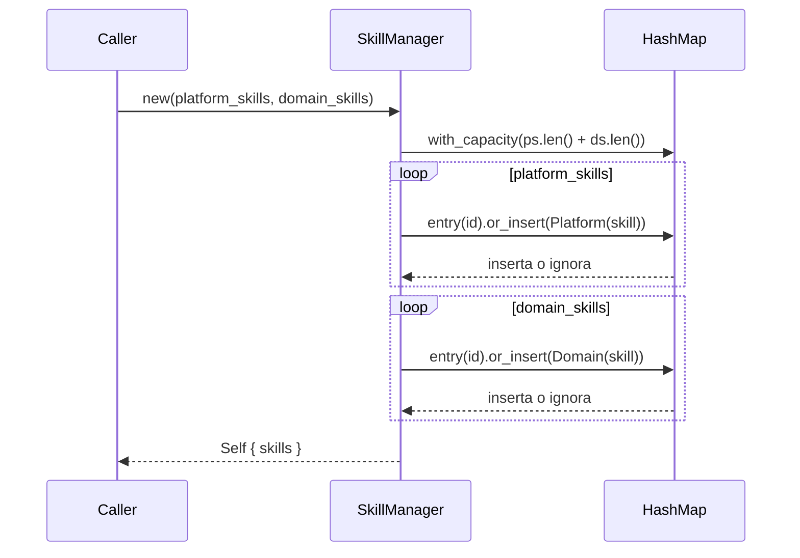

# T4: Gestor de skills

**Creada**: 2026-06-29
**Estado**: Implementada

---

## Instrucciones para el agente codificador

1. **Carga el skill `coder`** antes de empezar cualquier implementación. Sigue su guía.

2. **Cambia el estado** del plan en el encabezado según la fase en la que estés:
   - Al **terminar** exitosamente la codificación: cambia `**Estado**: En codificación` por `**Estado**: Implementada`.
   - Durante la codificación, si el plan necesita ajustes:
    - Si son cambios menores o locales, puedes aplicarlos directamente.
    - Si son modificaciones estructurales o de arquitectura, no las hagas tú: informa al usuario y pídele que cambie al agente `@spec/plan`, explicando los ajustes necesarios y su motivo.

3. **Sigue el plan detallado** que aparece a continuación. Es la fuente de verdad de lo que hay que implementar. Si encuentras una contradicción insalvable con el código real, resuélvela con el desarrollador. Si la solución requiere cambios en el plan, aplica el punto 2.

4. No uses códigos del tipo Letra+Número (T1, T2, CP1) en la documentación. Usa siempre nombres completos y semánticos.

5. Si detectas un problema en un documento ajeno, **rediriges al usuario al agente propietario** indicando tu sugerencia. No escribes en ficheros de cambios ajenos. Tu eres el programador, **nunca** puedes modificar `spec.md` ni `tasks.md`. A parte del código, solo podrías modificar el `plan.md`, si el usuario te da la autorización.

6. **No modifiques** esta sección de instrucciones.

---

## Plan detallado de implementación

### Contexto

Esta tarea refactoriza `SkillManager` en `manager.rs` para adoptar el constructor
único definido en el `tasks.md` actualizado. T1 (tipos y errores), T2 (Builder)
y T3 (markdown) ya están implementadas. El código actual de `manager.rs` usa
métodos `register_platform(&mut self)` y `register_domain(&mut self)` que deben
eliminarse.

Prerrequisitos ya existentes en el crate:

- `types.rs`: `PlatformSkill`, `DomainSkill`, `enum Skill`, `SkillMetadata` con
  métodos inherentes. `PlatformSkill::always_load()` es `pub(crate)`.
- `error.rs`: `LoadError { id: String }` con `#[error("Skill '{id}' not found")]`,
  deriva `PartialEq, Eq`.
- `lib.rs`: ya declara `pub mod manager;` y re-exporta `SkillManager`. Sin
  cambios necesarios en esta tarea (el doc comment del crate ya menciona
  `SkillManager`).

### Archivos a modificar

| Archivo | Acción |
|---------|--------|
| `carisa/skill/src/manager.rs` | Reescribir — constructor único, eliminar métodos de registro, reescribir todos los tests |

`lib.rs` no requiere cambios (el módulo y el re-export ya existen).

---

### Grupo 1 — Refactorizar `manager.rs`: struct, constructor y métodos

#### 1.1 — Doc del módulo

Actualizar el `//!` de `manager.rs` para reflejar el nuevo diseño: el manager
recibe todos los skills en construcción y es inmutable tras ella. Mencionar
que es `Send + Sync` por diseño (sin necesidad de `RwLock` para lectura
concurrente).

#### 1.2 — Struct `SkillManager`

Sin cambios en los campos: `skills: HashMap<String, Skill>`. Mantiene
`#[derive(Debug)]`. Se elimina cualquier mención a `register_*` en la
documentación del struct.

#### 1.3 — Constructor `new()`

**Firma**: `pub fn new(platform_skills: Vec<PlatformSkill>, domain_skills: Vec<DomainSkill>) -> Self`

**Algoritmo**:

1. Crear el `HashMap` con `HashMap::with_capacity(platform_skills.len() +
   domain_skills.len())`. Esto preasigna la tabla interna para el número exacto
   de entradas esperadas, evitando rehashes durante la inserción.

2. Iterar `platform_skills.into_iter()`. Para cada skill, obtener su id con
   `skill.id().to_owned()` e insertar con
   `entry(id).or_insert_with(|| Skill::Platform(skill))`. Si el id ya existe,
   se ignora silenciosamente (RF-010).

3. Iterar `domain_skills.into_iter()`. Misma lógica con
   `entry(id).or_insert_with(|| Skill::Domain(skill))`. Los ids ya presentes
   (de un platform anterior o de otro domain) se ignoran silenciosamente.

4. Devolver `Self { skills }`.

**Uso de `into_iter()`**: consume los vectores transfiriendo ownership, sin
clonaciones. `entry().or_insert_with()` realiza una sola búsqueda en el
HashMap para la semántica "insertar si ausente, ignorar si presente".

**Ids duplicados entre vectores**: como los platform se iteran primero, un
domain con el mismo id que un platform ya insertado se ignora. Entre skills
del mismo vector, prevalece el que aparece primero.

#### 1.4 — Eliminar `register_platform` y `register_domain`

Ambos métodos se eliminan por completo, incluyendo la anotación
`#[cfg_attr(not(test), expect(dead_code))]` que tenía `register_platform`.

#### 1.5 — Método `catalog(&self)`

Sin cambios. Se mantiene exactamente igual que en la implementación actual:

- Itera `self.skills.values()`
- Para `Skill::Platform(p)`: salta si `p.always_load()` es `true`; si no,
  construye `SkillMetadata` con `p.id().to_owned()` y `p.description().to_owned()`
- Para `Skill::Domain(d)`: siempre incluye, con `d.id().to_owned()` y
  `d.description().to_owned()`
- Devuelve el vector (vacío si no hay skills elegibles)

#### 1.6 — Método `load(&self, id: &str)`

Sin cambios. `self.skills.get(id)` → `Some(&skill)` devuelve `Ok(&skill)`;
`None` devuelve `Err(LoadError { id: id.to_owned() })`.

#### 1.7 — `impl Default for SkillManager`

Delega en el constructor: `default()` llama a `Self::new(vec![], vec![])`.
El `HashMap` vacío es el valor por defecto correcto.

#### Resumen de métodos tras la refactorización

| Método | Visibilidad | `self` | Retorno |
|--------|-------------|--------|---------|
| `new(Vec<PS>, Vec<DS>)` | `pub` | — | `Self` |
| `catalog()` | `pub` | `&self` | `Vec<SkillMetadata>` |
| `load(id)` | `pub` | `&self` | `Result<&Skill, LoadError>` |

Ningún método toma `&mut self`. El manager es inmutable tras construcción.

---

### Grupo 2 — `lib.rs`

Sin cambios. El módulo `pub mod manager;` y el re-export
`pub use manager::SkillManager;` ya existen y son correctos. El doc comment
del crate (`//!`) ya menciona `SkillManager` adecuadamente.

---

### Grupo 3 — Tests unitarios

Todos los tests actuales se reescriben para usar el constructor `new()` en
lugar de construir vacío y luego llamar a `register_*`. Los tests se ubican
en `#[cfg(test)] mod tests` al final de `manager.rs`. Se usa `rstest` (ya en
`dev-dependencies`) para los casos parametrizables. Los imports necesarios:
`DomainSkillBuilder`, `PlatformSkillBuilder` desde `crate::types`.

#### Test 3.1 — Exclusión de always_load en catálogo (T4-CP1)

- **Setup**: Construir con Builder dos `PlatformSkill`: uno con id `"core"` y
  `always_load: true`; otro con id `"helper"` y `always_load: false`.
- **Acción**: `SkillManager::new(vec![ps_always, ps_normal], vec![])`,
  luego `manager.catalog()`.
- **Asserts**: el catálogo tiene longitud 1, su única entrada tiene id
  `"helper"` y description `"Helper description"`.

#### Test 3.2 — Múltiples skills de dominio (T4-CP2)

- **Setup**: Construir con Builder 3 `DomainSkill` con ids `"a"`, `"b"`, `"c"`.
- **Acción**: `SkillManager::new(vec![], vec![a, b, c])`, luego `catalog()`.
- **Asserts**: `catalog.len() == 3`. Verificar con `iter().any()` que los tres
  ids aparecen, sin asumir orden.

#### Test 3.3 — Catálogo vacío (T4-CP3)

- **Setup**: `SkillManager::new(vec![], vec![])`.
- **Acción**: `manager.catalog()`.
- **Assert**: `catalog.is_empty()` es `true`. Sin panic.

#### Test 3.4 — `load()` exitoso con instructions sin clon (T4-CP4)

- **Setup**: Construir un `DomainSkill` con id `"guide"` e instructions
  `"Do X then Y"`.
- **Acción**: `SkillManager::new(vec![], vec![skill])`, luego
  `let instructions = manager.load("guide").unwrap().instructions();`
- **Asserts**:
  - `instructions == "Do X then Y"`.
  - Verificar que compila sin `.to_owned()` sobre `instructions()`, es decir,
    el tipo inferido es `&str`.

#### Test 3.5 — `load()` con id inexistente (T4-CP5)

- **Setup**: Construir un `DomainSkill` con id `"exists"`. Pasar al constructor
  `new(vec![], vec![skill])`.
- **Acción**: `let result = manager.load("no-existe");`
- **Asserts**:
  - `result.is_err()`.
  - `result.unwrap_err() == LoadError { id: "no-existe".to_owned() }`
    (gracias a `PartialEq, Eq` en `LoadError`).

#### Test 3.6 — Platform con id duplicado en el mismo vector (T4-CP6)

- **Setup**: Construir dos `PlatformSkill` con mismo id `"dup"` pero distinta
  description/instructions: el primero con instructions `"primero"`, el
  segundo con `"segundo"`.
- **Acción**: `SkillManager::new(vec![ps1, ps2], vec![])`.
- **Asserts**:
  - `manager.load("dup").unwrap().instructions() == "primero"` — el primero
    prevalece.
  - `manager.catalog().len() == 1`.

#### Test 3.7 — Domain con id duplicado en el mismo vector (T4-CP7)

- **Setup**: Construir dos `DomainSkill` con mismo id `"dup"`, el primero con
  instructions `"first"`, el segundo `"second"`.
- **Acción**: `SkillManager::new(vec![], vec![ds1, ds2])`.
- **Asserts**:
  - `manager.load("dup").unwrap().instructions() == "first"`.
  - `manager.catalog().len() == 1`.

#### Test 3.8 — Platform y domain con mismo id (T4-CP8)

- **Setup**: Construir un `PlatformSkill` con id `"shared"` e instructions
  `"platform"`, y un `DomainSkill` con mismo id `"shared"` e instructions
  `"domain"`.
- **Acción**: `SkillManager::new(vec![ps], vec![ds])`.
- **Asserts**:
  - `manager.load("shared").unwrap().instructions() == "platform"` —
    el platform prevalece porque se itera primero.
  - `manager.catalog().len() == 1`.

#### Test 3.9 — Vectores vacíos (T4-CP9)

- **Setup**: `SkillManager::new(vec![], vec![])`.
- **Asserts**:
  - `manager.catalog().is_empty()` — sin entradas, sin error.
  - `manager.load("anything").is_err()` — cualquier búsqueda falla.

#### Test 3.10 — Mezcla platform + domain (T4-CP10)

- **Setup**: Construir:
  - `PlatformSkill` con id `"core"`, `always_load: true`
  - `PlatformSkill` con id `"helper"`, `always_load: false`
  - `DomainSkill` con id `"custom"`
- **Acción**: `SkillManager::new(vec![ps_always, ps_normal], vec![ds])`,
  luego `catalog()`.
- **Asserts**:
  - `catalog.len() == 2` — `"core"` excluido por `always_load`.
  - Los ids `"helper"` y `"custom"` aparecen; `"core"` no.

#### Test 3.11 — `Arc<SkillManager>` (T4-CP11, RT-006)

- **Setup**: Construir un `DomainSkill` con id `"x"` e instructions `"Do X"`.
  Crear `SkillManager::new(vec![], vec![skill])` y envolver en
  `Arc::new(manager)`.
- **Acción**: Desde el `Arc`, llamar a
  `shared.load("x").unwrap().instructions().to_owned()`.
- **Asserts**:
  - `instructions == "Do X"`.
  - Verificar que `catalog()` desde el `Arc` también funciona.
- **Nota**: No se usa `RwLock`. Como el manager es inmutable tras construcción,
  `Arc<SkillManager>` es suficiente para acceso concurrente de solo lectura.

#### Test 3.12 — `Debug` y `Default`

- **Setup**: `SkillManager::default()`.
- **Asserts**:
  - `manager.catalog().is_empty()`.
  - `format!("{manager:?}")` compila y no produce panic.

---

### Notas técnicas

1. **`HashMap::with_capacity()`**: preasigna la tabla interna para
   `platform_skills.len() + domain_skills.len()` entradas. Para los ~20-50
   skills típicos, evita uno o dos rehashes. El coste en memoria es
   insignificante (la capacidad se redondea a la siguiente potencia de 2).

2. **Inmutabilidad post-construcción**: todos los métodos toman `&self`.
   Esto elimina la necesidad de `RwLock` para acceso concurrente de solo
   lectura. `Arc<SkillManager>` es suficiente. RT-006 se cumple: el manager
   es `Send + Sync + 'static` automáticamente porque `HashMap<String, Skill>`
   lo es.

3. **`load()` devuelve `&Skill`, no `&str`**: el consumidor accede a
   cualquier método inherente (`id()`, `title()`, `description()`,
   `instructions()`) vía la referencia, sin clon.

4. **`catalog()` asigna `String` owned**: necesario porque el catálogo es un
   valor independiente. Las strings son cortas (ids y descripciones), el
   coste es mínimo.

5. **Política de duplicados RF-010**: `entry().or_insert_with()` garantiza
   que la primera inserción para un id prevalece. Los platform se iteran
   primero, por lo que un platform tiene precedencia sobre un domain con el
   mismo id.

6. **Tests**: cada test construye el manager en una sola llamada a `new()`.
   No hay mutación posterior. Se usan los Builders de `derive_builder` para
   construir los skills de prueba.

---

### Validación de coherencia con el código existente (2026-06-29)

Se verificó que los archivos referenciados (`manager.rs`, `lib.rs`, `types.rs`,
`error.rs`) existen y que las firmas, tipos y patrones propuestos son compatibles
con el código implementado en T1, T2 y T3. Sin discrepancias detectadas.
